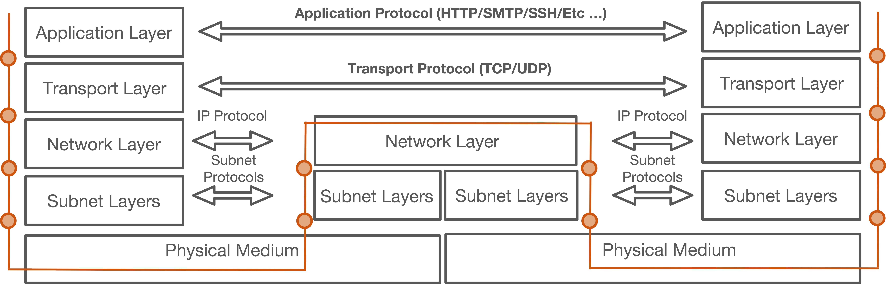
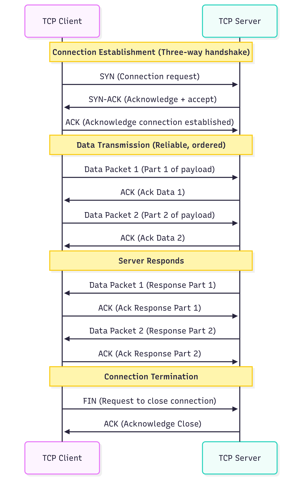
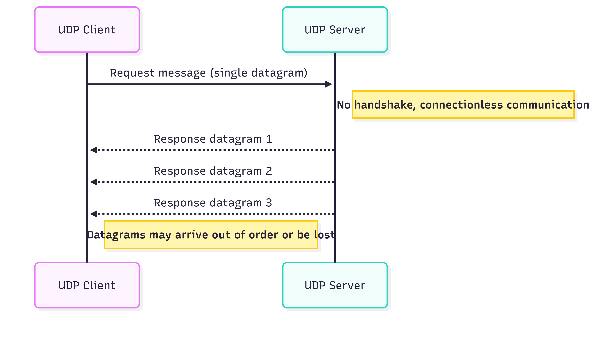
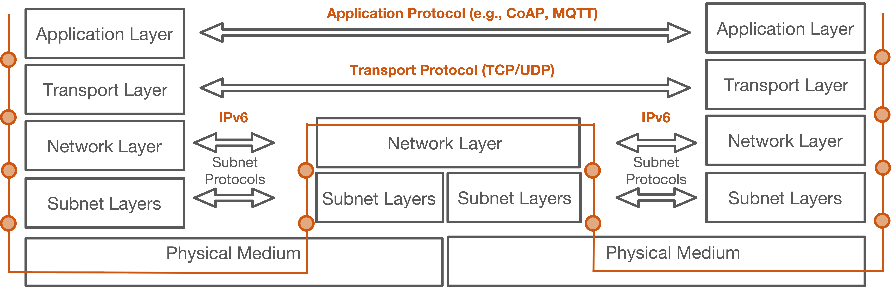
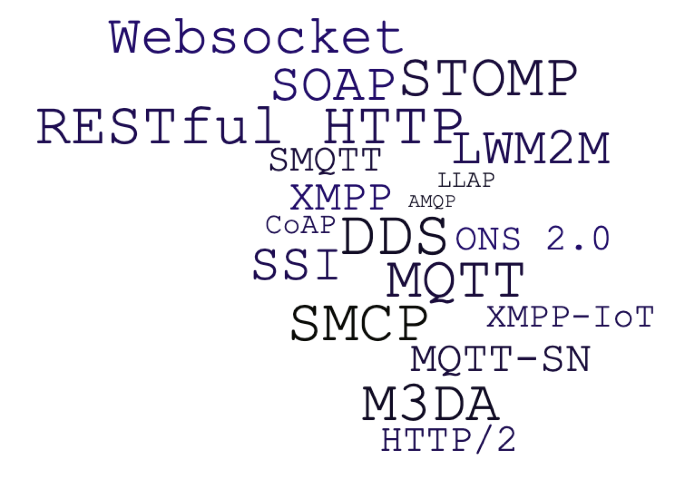
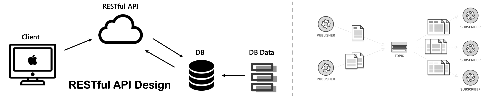
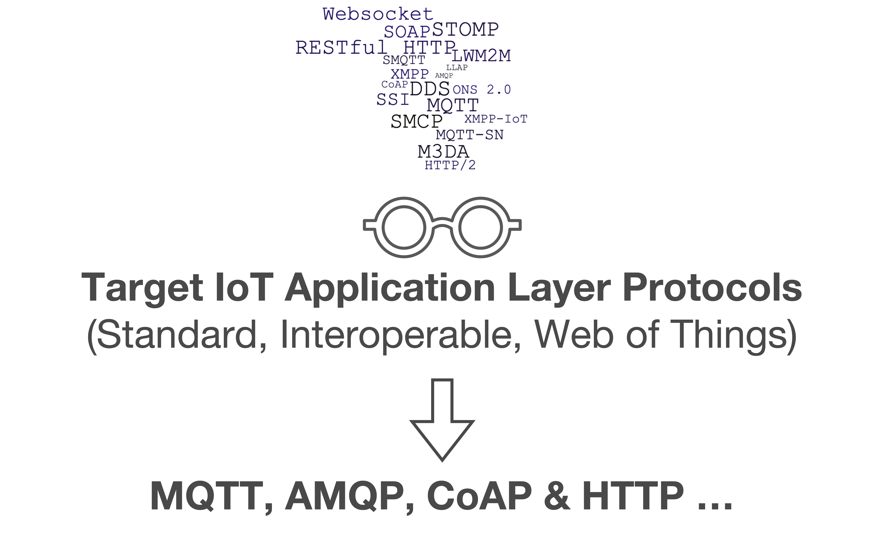

<!-- omit in toc -->
# Lecture 3 - IoT Protocols Characteristics & Overview

<!-- omit in toc -->
## Lecture Information

| **Bachelor's Degree**| Computer Engineering (D.M.270/04)                                                |
|----------------------|----------------------------------------------------------------------------------|
| **Course**           | Intelligent Internet of Things                                                   |
| **Lecture Title**    | IoT Protocols Characteristics & Overview                                         |
| **Author**           | Prof. Marco Picone (marco.picone@unimore.it)                                     |
| **License**          | [Creative Commons Attribution 4.0](https://creativecommons.org/licenses/by/4.0/) | 


<!-- omit in toc -->
# Table of Contents

- [3.1 Traditional Internet Protocol Stack (Overview)](#31-traditional-internet-protocol-stack-overview)
  - [3.1.1 TCP \& UDP Protocols (Quick Overview)](#311-tcp--udp-protocols-quick-overview)
    - [3.1.1.1 TCP (Transmission Control Protocol)](#3111-tcp-transmission-control-protocol)
    - [3.1.1.2 UDP (User Datagram Protocol)](#3112-udp-user-datagram-protocol)
    - [3.1.1.3 TCP/UDP Comparison Summary Table](#3113-tcpudp-comparison-summary-table)
    - [3.1.1.4 The Need for Application Layer Protocols](#3114-the-need-for-application-layer-protocols)
- [3.2 IoT Protocol Stack (Overview)](#32-iot-protocol-stack-overview)
- [3.3 Simple Comparison Between Traditional Internet Protocol Stack and IoT Protocol Stack](#33-simple-comparison-between-traditional-internet-protocol-stack-and-iot-protocol-stack)
- [3.4 IoT Application Layer Protocols](#34-iot-application-layer-protocols)
- [3.5 Main Protocols Interaction Models](#35-main-protocols-interaction-models)
- [3.6 Protocols Objectives - Towards Standardization and Interoperability](#36-protocols-objectives---towards-standardization-and-interoperability)
- [References](#references)
  
# 3.1 Traditional Internet Protocol Stack (Overview)



**Figure 3.1:** Traditional Internet Protocol Stack (Overview) with the different layers and their main protocols.

The **traditional protocol stack** is fundamental for modeling and understanding how digital communications work. By organizing network functions into **hierarchical layers**, each with specific responsibilities, the stack enables modular design and interoperability. The most common models are the **OSI** and **TCP/IP** stacks, which structure communication from the physical transmission of bits up to user-facing applications.

**OSI vs. TCP/IP: Quick Differences and Similarities**

- **OSI Model** has 7 layers (Physical, Data Link, Network, Transport, Session, Presentation, Application).
- **TCP/IP Model** has 4 layers (Link, Internet, Transport, Application).
- OSI separates presentation and session functions; TCP/IP combines them into the application layer.
- OSI is a theoretical reference model; TCP/IP is based on real-world protocols.
- Both models use layered architecture to promote modularity and interoperability.
- Each layer in both models serves specific functions and communicates with adjacent layers.
- Both models guide protocol design and troubleshooting in network engineering.

**Protocol Stack Layer Overview**

Each layer in the protocol stack abstracts and manages a distinct aspect of communication, relying on adjacent layers for data exchange. This layered modeling simplifies development, troubleshooting, and protocol evolution. In this overview, we focus on a simplified 5-layer model that captures the essential functions of both OSI and TCP/IP stacks:


| **Layer**           | **Main Function**                                   | **Common Protocols**           |
|---------------------|-----------------------------------------------------|-------------------------------|
| **Physical**        | Transmission of raw bits over physical medium       | Ethernet (PHY), Wi-Fi (PHY)   |
| **Data Link**       | Framing, error detection/correction, MAC addressing | Ethernet, Wi-Fi (MAC), PPP    |
| **Network**         | Routing, addressing, packet forwarding              | IP (Internet Protocol), ICMP  |
| **Transport**       | Reliable delivery, sequencing, flow control         | TCP, UDP                      |
| **Application**     | End-user services and protocols                     | HTTP, HTTPS, SMTP, SSH        |


- **Physical Layer**: The base layer, responsible for the actual transmission of data as electrical signals, light pulses, or radio waves over cables, fiber optics, or wireless channels.
- **Data Link Layer**: Handles framing, error detection/correction, and local addressing (MAC). It ensures reliable communication within a local network segment.
- **Network Layer**: Manages logical addressing and routing, enabling data packets to traverse multiple interconnected networks. The **IP protocol** is central here.
- **Transport Layer**: Provides end-to-end communication, reliability, and flow control. **TCP** ensures ordered, reliable delivery; **UDP** offers faster, connectionless transmission.
- **Application Layer**: Hosts protocols for user-facing services, such as **HTTP** for web, **SMTP** for email, and **SSH** for secure remote access.

**Protocol and Communication Flow**

Data originates at the **application layer**, then is **encapsulated** as it passes down through the transport, network, and data link layers, each adding its own header (and sometimes trailer) information. This encapsulation process is called **packet encapsulation**. At the sender, each layer wraps the data from the layer above, forming a protocol data unit (PDU) for transmission. The physical layer then transmits the bits over the medium.

On the receiving side, the process is reversed: each layer removes its header/trailer, passing the remaining data up to the next layer until the original application data is reconstructed.

### Encapsulation Example: HTTP → TCP → IP → Data Link

When a browser requests a web page, the data travels down the protocol stack. Each layer **wraps** the payload from the layer above with its own header (and, for the Data Link layer, a trailer).

**1. Application Layer: HTTP**

The application creates the message. This is the original **data**.

```http
GET /index.html HTTP/1.1
Host: www.example.com
User-Agent: Mozilla/5.0
Accept: text/html
```

**2. Transport Layer: TCP**

TCP adds a header to the HTTP message. The result is called a **segment**.

| TCP Header Field    | Example Value |
|---------------------|---------------|
| Source Port         | 51234         |
| Destination Port    | 80            |
| Sequence Number     | 1000          |
| Acknowledgment No.  | 0             |
| Flags               | PSH, ACK      |
| Window Size         | 65535         |
| Checksum            | 0x1a2b        |

```
+------------+----------------------------+
| TCP Header |        HTTP Message        |
+------------+----------------------------+
|<---------------- Segment -------------->|
```

**3. Network Layer: IP**

IP adds its own header to the TCP segment. The result is called a **packet**.

| IP Header Field     | Example Value  |
|---------------------|----------------|
| Version             | 4              |
| Protocol            | 6 (TCP)        |
| TTL                 | 64             |
| Source Address      | 192.168.1.10   |
| Destination Address | 93.184.216.34  |

```
+-----------+------------+----------------------------+
| IP Header | TCP Header |        HTTP Message        |
+-----------+------------+----------------------------+
|<------------------- Packet ------------------------>|
```

**4. Data Link Layer: Ethernet**

The Data Link layer adds a header and a trailer. The result is called a **frame**.

| Field            | Example Value       |
|------------------|---------------------|
| Destination MAC  | 00:1A:2B:3C:4D:5E   |
| Source MAC       | 00:1F:3A:4B:5C:6D   |
| EtherType        | 0x0800 (IPv4)       |
| FCS (trailer)    | CRC-32              |

```
+--------------+-----------+------------+--------------+---------+
| Eth Header   | IP Header | TCP Header | HTTP Message | Eth     |
|              |           |            |              | Trailer |
+--------------+-----------+------------+--------------+---------+
|<------------------------- Frame ---------------------------->|
```

**Summary**

| Layer        | Protocol | Unit (PDU) | Adds                          |
|--------------|----------|------------|-------------------------------|
| Application  | HTTP     | Data       | Request/response message      |
| Transport    | TCP      | Segment    | Ports, sequence numbers       |
| Network      | IP       | Packet     | Source/destination IP address |
| Data Link    | Ethernet | Frame      | MAC addresses, CRC trailer    |

> **Note:** At the receiver, the process is reversed (**decapsulation**):
> each layer strips its own header and passes the payload upward.

## 3.1.1 TCP & UDP Protocols (Quick Overview)

**TCP (Transmission Control Protocol)** and **UDP (User Datagram Protocol)** are two fundamental transport layer protocols in the Internet protocol suite, each with distinct characteristics, strengths, and application scenarios.

---

### 3.1.1.1 TCP (Transmission Control Protocol)

**Characteristics:**

- Connection-oriented protocol establishing a reliable connection between sender and receiver.
- Provides guaranteed data delivery through acknowledgments (ACKs), retransmissions, and sequence ordering.
- Ensures in-order delivery of packets and error detection/correction.
- Implements flow control and congestion control to optimize network usage.
- Suitable for applications where data integrity and reliability are crucial.

**Internet Usage:**

- Web browsing (HTTP/HTTPS), email (SMTP, IMAP), file transfer (FTP), and other use cases needing reliable communication.
- Ensures all data reaches the destination intact and in the correct sequence.

**IoT Usage:**

- Used for IoT devices requiring reliable commands and data, such as firmware updates, configuration, secure communications.
- Common in smart home devices, industrial control systems where data loss is unacceptable.



**Figure 3.2:** TCP Communication Schema Example.

---

### 3.1.1.2 UDP (User Datagram Protocol)

**Characteristics:**

- Connectionless protocol that sends datagrams without ensuring delivery or order.
- No acknowledgments or retransmission mechanisms; minimal overhead.
- Faster and more efficient for time-sensitive applications.
- Suitable where occasional data loss is tolerable or where application-layer protocols handle reliability.

**Internet Usage:**

- Streaming media (audio/video), online gaming, DNS, VoIP where low latency is prioritized over reliability.
- Enables faster transmission by avoiding handshake and retransmission delays.

**IoT Usage:**

- Favored in resource-constrained devices and networks for lightweight communication.
- Used for telemetry, sensor data, where frequent updates make occasional loss acceptable.
- Protocols like CoAP and MQTT-SN are built on UDP for efficiency, especially in battery-powered or low-bandwidth scenarios.



**Figure 3.3:** UDP Communication Schema Example.

---

### 3.1.1.3 TCP/UDP Comparison Summary Table

| Feature                | TCP                                   | UDP                              |
|------------------------|-------------------------------------|---------------------------------|
| Connection type        | Connection-oriented                   | Connectionless                  |
| Reliability            | Guaranteed delivery with retransmissions | No guarantee, best effort       |
| Ordering               | Ensures data order                    | No ordering                    |
| Overhead               | Higher (ACKs, flow/congestion control) | Lower, minimal                  |
| Latency                | Higher due to connection setup       | Low latency                    |
| Usage scenarios        | Web, email, file transfers            | Streaming, gaming, IoT telemetry|
| IoT use cases          | Reliable command/control data          | Sensor telemetry, lightweight data|


---

### 3.1.1.4 The Need for Application Layer Protocols

While **transport protocols** such as **TCP** and **UDP** are responsible for the reliable delivery, packaging, and ordering of data between devices, they do not address how the actual application data should be **structured**, **interpreted**, or **managed**. This gap is filled by **application layer protocols**, which are crucial for modeling robust and interoperable systems.

**Key modeling characteristics of application layer protocols:**

- **Standardized Communication**: Define how applications exchange information, ensuring consistency across diverse platforms and devices.
- **Message Structure & Semantics**: Specify the format, encoding, and meaning of messages, so both clients and servers can correctly interpret commands and data.
- **Interaction Patterns**: Establish rules for request/response, publish/subscribe, and other communication paradigms, supporting scalable and flexible architectures.
- **Domain-Specific Logic**: Enable modeling of commands, queries, and resource manipulation tailored to the application's requirements.

> In summary, when modeling distributed systems, **application layer protocols** provide the essential framework for meaningful, standardized, and interoperable communication on top of transport protocols, enabling applications to understand and process exchanged data reliably.

# 3.2 IoT Protocol Stack (Overview)



**Figure 3.4:** IoT Protocol Stack (Overview) with the different layers and their main protocols.

The **IoT protocol stack** builds upon the **traditional networking model** but introduces specialized layers, protocols, and adaptations to address the unique requirements of **resource-constrained devices**, **heterogeneous networks**, and **intermittent connectivity**. Modeling the IoT stack involves understanding how each layer is tailored for efficiency, scalability, and interoperability, while still maintaining the modularity and abstraction principles of classic protocol stacks.
**Key Layers and Protocols in IoT Stack Modeling**

- **Physical and Data Link Layers**: IoT networks often use low-power wireless technologies such as **ZigBee**, **LoRa**, **NB-IoT**, and **Bluetooth Low Energy (BLE)**, chosen for their energy efficiency, range, and suitability for large-scale deployments. Standards like **IEEE 802.15.4** provide the foundation for these technologies, supporting minimal energy consumption and cost-effective connectivity for battery-powered devices.

- **Network Layer**: To accommodate massive numbers of devices, IoT stacks typically adopt **IPv6** for its large address space. Protocols like **6LoWPAN** enable efficient transmission of IPv6 packets over constrained links, ensuring seamless integration with global networks while maintaining scalability and efficiency.

- **Transport Layer**: IoT environments require a balance between reliability and efficiency. While **TCP** and **UDP** are still used, adaptations such as **DTLS** (for secure UDP communication) are common to address low-latency and lossy network conditions, ensuring robust communication in challenging scenarios.

- **Application Layer**: Protocols like **MQTT**, **CoAP**, and **LwM2M** are designed for lightweight, efficient messaging, minimizing overhead and supporting intermittent connectivity. These protocols prioritize simplicity, low power consumption, and reliability, making them well-suited for resource-constrained IoT devices compared to traditional, heavier protocols like **HTTP**.


> Modeling the IoT protocol stack involves selecting and adapting layers and protocols to optimize for energy efficiency, scalability, and interoperability, addressing the unique requirements of diverse IoT environments.

**Interoperability and Ecosystem Integration**

- The IoT stack emphasizes **interoperability**, enabling seamless integration across diverse devices, vendors, and networks. **Protocol gateways** (e.g., ZigBee-to-IP converters) and **multi-stack solutions** facilitate communication between different technologies.
- **Open standards** and **unified APIs** are promoted to avoid vendor lock-in and foster ecosystem growth, ensuring that devices using specialized IoT protocols can participate in broader Internet-connected applications.

---

# 3.3 Simple Comparison Between Traditional Internet Protocol Stack and IoT Protocol Stack

**Comparison: IoT Protocol Stack vs. Traditional Internet Protocol Stack**

| **Layer**           | **Traditional Stack**                                   | **IoT Stack**                                                                 |
|---------------------|--------------------------------------------------------|--------------------------------------------------------------------------------|
| **Physical**        | Ethernet, Wi-Fi                                        | ZigBee, LoRa, NB-IoT, BLE, Ethernet, Wi-Fi                                     |
| **Data Link**       | Ethernet (MAC), Wi-Fi (MAC), PPP                       | IEEE 802.15.4, ZigBee, Thread, BLE                                             |
| **Network**         | IPv4, IPv6, ICMP                                       | IPv6, 6LoWPAN, RPL                                                             |
| **Transport**       | TCP, UDP                                               | UDP, TCP, DTLS (secure UDP), lightweight adaptations                           |
| **Application**     | HTTP, HTTPS, SMTP, SSH                                 | MQTT, CoAP, LwM2M, lightweight REST, custom IoT protocols                      |
| **Modeling Focus**  | High throughput, reliability, modularity               | Low power, scalability, interoperability, efficiency, resource constraints     |

The **IoT protocol stack** is modeled to optimize for **energy efficiency**, **scalability**, and **interoperability**, using lightweight protocols and specialized layers. In contrast, the **traditional stack** prioritizes **high throughput** and **reliability** for general-purpose computing and communication. Understanding these differences is essential for designing robust IoT systems that can seamlessly integrate with existing Internet infrastructure.

---

# 3.4 IoT Application Layer Protocols



**Figure 3.5:** Some application layer protocols.

The **application layer** in networking models (OSI Levels 5, 6, and 7; TCP/IP application layer) is the **topmost layer** that interfaces between **end devices**, the **network**, and **user applications**. It is implemented via dedicated software at the device level and is responsible for **data formatting**, **presentation**, and **protocol-specific communication**. In traditional Internet services, protocols such as **HTTP**, **HTTPS**, **SMTP**, and **FTP** operate at this layer, enabling web browsing, secure transactions, email, and file transfers.

When **modeling IoT systems**, the application layer plays a crucial role in defining how devices interact, exchange data, and integrate with broader networks. However, **traditional protocols** are often **unsuitable for IoT environments** due to their **heavyweight nature** and **high parsing overhead**. IoT devices are typically **resource-constrained**—with limited CPU, memory, and energy—making it essential to use **lightweight protocols** that minimize computational and transmission demands.

**Key modeling considerations for IoT application layer protocols:**

- **CPU Processing:** IoT devices have **limited computational capabilities**, making it difficult to process large or complex messages. **Reducing processing requirements** leads to **lower energy consumption** and longer device lifespans.
- **Data Transmission:** Large messages result in more **fragments**, increasing **overhead** and the likelihood of **retransmissions**—especially in **Low-power and Lossy Networks (LLNs)**. This can cause **higher delays** and further drain energy resources.
- **Efficiency and Scalability:** Lightweight protocols such as **MQTT**, **CoAP**, and **LwM2M** are specifically designed for IoT, focusing on **minimal overhead**, **efficient parsing**, and **robustness** in unreliable network conditions.

> In summary, modeling the application layer for IoT involves selecting protocols that optimize for **efficiency**, **scalability**, and **interoperability**, ensuring reliable communication while respecting the constraints of IoT devices and networks.

---

# 3.5 Main Protocols Interaction Models



**Figure 3.6:** Quick comparison of main protocols interaction models among Request/Response and Publish/Subscribe.

When modeling IoT systems, **protocols** are designed around specific **communication paradigms** such as **request/response** and **publish/subscribe**. Each paradigm introduces distinct **requirements** that influence the selection of the most suitable protocol and **architectural style** for a given scenario.

- The **request/response** paradigm is commonly used in **RESTful architectures**, where a client sends a request and the server responds with the required data. This model is straightforward and fits well for scenarios where devices need to **retrieve or update resources** on demand.
- The **publish/subscribe** paradigm enables **asynchronous communication**, allowing devices to **publish data** to topics and other devices to **subscribe** and receive updates automatically. This model is ideal for **event-driven** IoT applications, such as sensor networks and real-time monitoring.

**Modeling the communication architecture** involves analyzing the specific needs of your scenario—such as **latency**, **scalability**, **energy efficiency**, and **data flow patterns**—to determine which paradigm and protocol best fit. While there is no universal solution, the **IoT ecosystem** is predominantly built around the **REST architectural style** (mirroring the traditional Internet) and **publish/subscribe approaches** for flexibility and scalability.

> **Key takeaway:** Select the communication paradigm and protocol that align with your application's requirements, considering factors like device constraints, network reliability, and integration needs. Both **REST** and **Pub/Sub** are foundational to modern IoT system modeling.

> **Note:** There are several protocols belonging to both paradigms, but in this lecture, we will focus on **HTTP** (request/response) and **MQTT** (publish/subscribe) as representative examples.
> Additionally, we will briefly mention **CoAP**, which, despite being a request/response protocol, is specifically designed for constrained environments. 
> We will not cover **AMQP** and **DDS** in this lecture, but they are also important protocols in the IoT landscape.

---

# 3.6 Protocols Objectives - Towards Standardization and Interoperability



**Figure 3.7:** The objective of IoT application layer protocols is to achieve standardization and interoperability.

When **modeling IoT systems**, protocols such as **MQTT**, **AMQP**, **CoAP**, and **HTTP** are chosen for their **wide adoption** and **design principles** that enable **cross-device** and **cross-vendor communication**.

- **Interoperability**: Adopting **standard protocols** ensures that devices from different manufacturers and domains can interact seamlessly, which is essential for building unified IoT solutions and ecosystems. This interoperability is a key modeling objective, as it allows diverse devices to exchange data reliably and efficiently.
- **Standard Usage**: Relying on **established, well-documented protocols** helps prevent fragmentation and vendor lock-in, supporting **large-scale deployments** and **future-proof integration**. Modeling with these protocols provides a stable foundation for expanding and maintaining IoT systems over time.

> The success of IoT modeling depends on selecting **standard, interoperable protocols** to build robust, scalable, and maintainable connected systems. The figure below illustrates that the primary goal of IoT application layer protocols is to achieve **standardization** and **interoperability**, laying the groundwork for the "**Web of Things**" where diverse devices and platforms can communicate easily and reliably.

---


# References

- J. P. Vasseur and A. Dunkels, “Interconnecting Smart Objects with IP,” Morgan Kaufmann, 2010
- S. Cirani, G. Ferrari, M. Picone, and L. Veltri, “Internet of Things: Architectures, Protocols and Standards”, Wiley 2018.
