<!-- omit in toc -->
# Lecture 4 - The HTTP Protocol & RESTful Architectural Style

<!-- omit in toc -->
## Lecture Information

| **Bachelor's Degree**| Computer Engineering (D.M.270/04)                                                |
|----------------------|----------------------------------------------------------------------------------|
| **Course**           | Intelligent Internet of Things                                                   |
| **Lecture Title**    | The HTTP Protocol & RESTful Architectural Style                                  |
| **Author**           | Prof. Marco Picone (marco.picone@unimore.it)                                     |
| **License**          | [Creative Commons Attribution 4.0](https://creativecommons.org/licenses/by/4.0/) | 

<!-- omit in toc -->
# Table of Contents

- [4.1 Using a Web-Based Approach for the Internet of Things](#41-using-a-web-based-approach-for-the-internet-of-things)
- [4.2 The HTTP Protocol](#42-the-http-protocol)
  - [4.2.1 The Structure of an HTTP Message - The Request Message - GET](#421-the-structure-of-an-http-message---the-request-message---get)
  - [4.2.2 The Structure of an HTTP Message - The Response Message - GET](#422-the-structure-of-an-http-message---the-response-message---get)
  - [4.2.3 The Structure of an HTTP Message - The Request Message - POST](#423-the-structure-of-an-http-message---the-request-message---post)
  - [4.2.4 The Structure of an HTTP Message - The Response Message - POST](#424-the-structure-of-an-http-message---the-response-message---post)
  - [4.2.5 The Web as a Platform](#425-the-web-as-a-platform)
- [4.3 REpresentational State Transfer (REST) Architectural Style](#43-representational-state-transfer-rest-architectural-style)
  - [4.3.1 The concept of Resource in REST](#431-the-concept-of-resource-in-rest)
  - [4.3.2 Differences with Other Architectural Styles](#432-differences-with-other-architectural-styles)
  - [4.3.3 A Simple Comparison Between REST and SOAP](#433-a-simple-comparison-between-rest-and-soap)
  - [4.3.4 The Client Perspective REST vs. SOAP](#434-the-client-perspective-rest-vs-soap)
  - [4.3.5 REST Main Characteristics](#435-rest-main-characteristics)
  - [4.3.6 REST \& Resource Representation](#436-rest--resource-representation)
  - [4.3.7 REST Resource Identifier \& URI](#437-rest-resource-identifier--uri)
  - [4.3.8 REST \& URI Example](#438-rest--uri-example)
  - [4.3.9 URI \& Representations](#439-uri--representations)
  - [4.3.10 REST \& Statelessness](#4310-rest--statelessness)
  - [4.4 REST Maturity Levels](#44-rest-maturity-levels)
    - [4.4.1 Level 0: The Swamp of POX (Plain Old XML)](#441-level-0-the-swamp-of-pox-plain-old-xml)
      - [4.4.1.1 Level 0 Example](#4411-level-0-example)
      - [4.4.1.2 Level 0 Characteristics \& Limitations](#4412-level-0-characteristics--limitations)
    - [4.4.2 Level 1: Resources](#442-level-1-resources)
      - [4.4.2.1 Level 1: Example](#4421-level-1-example)
      - [4.4.2.2 Level 1 Characteristics \& Limitations](#4422-level-1-characteristics--limitations)
    - [4.4.3 Level 2: HTTP Methods](#443-level-2-http-methods)
      - [4.4.3.1 Level 2: Response Codes](#4431-level-2-response-codes)
      - [4.4.3.2 Level 2: Do not reinvent the wheel (with Status Codes)](#4432-level-2-do-not-reinvent-the-wheel-with-status-codes)
      - [4.4.3.3 Level 2: HTTP Headers](#4433-level-2-http-headers)
      - [4.4.3.4 Level 2: Interaction Flow - Create a New Resource](#4434-level-2-interaction-flow---create-a-new-resource)
      - [4.4.3.5 Level 2: Interaction Flow - Read a Resource](#4435-level-2-interaction-flow---read-a-resource)
      - [4.4.3.6 Level 2: Interaction Flow - Update a Resource](#4436-level-2-interaction-flow---update-a-resource)
      - [4.4.3.7 Level 2: Interaction Flow - Delete a Resource](#4437-level-2-interaction-flow---delete-a-resource)
      - [4.4.3.8 Level 2: The Calendar Example Revisited](#4438-level-2-the-calendar-example-revisited)
      - [4.4.3.9 Level 2: URI Templates \& Conventions](#4439-level-2-uri-templates--conventions)
    - [4.5 Level 3: Hypermedia as the Engine of Application State (HATEOAS)](#45-level-3-hypermedia-as-the-engine-of-application-state-hateoas)
- [References](#references)
  
# 4.1 Using a Web-Based Approach for the Internet of Things

When **modeling IoT systems**, adopting a **web-based approach** offers several advantages:

- The **web ecosystem** has matured over decades, providing a wealth of **experience** and **best practices** for designing scalable, interoperable systems.
- **HTTP** is the **dominant application-layer protocol**, ensuring broad compatibility and simplifying integration with existing Internet infrastructure.
- A wide range of **software libraries** and **tools** for web protocols (such as **web servers** and **HTTP clients**) are available for virtually **every programming language**, accelerating development and reducing implementation effort.
- Well-established **design patterns** for **web applications** enable developers to model IoT solutions efficiently, leveraging familiar architectures and workflows.
- The **web architecture** has demonstrated exceptional **scalability**, which is crucial for supporting **billions of connected IoT devices**.

By modeling IoT systems using **web standards** and protocols, developers benefit from proven technologies, enhanced interoperability, and the ability to scale solutions to meet the demands of large, heterogeneous device networks.

For this reason, in this lecture we will focus on the **HTTP protocol** and the **RESTful architectural style**, which are widely adopted for building web-based IoT applications and also for traditional web applications. 

> **Note:** IoT device with constrained resources (e.g., limited processing power, memory, and energy) may not be able to use HTTP directly. In such cases, lightweight protocols like **CoAP (Constrained Application Protocol)** are often employed. CoAP is designed specifically for constrained environments and provides similar functionalities to HTTP but with reduced overhead, making it suitable for resource-limited IoT devices. In this lecture, however, we will focus on HTTP and REST as they are the most widely used protocols for web-based applications, including many IoT scenarios and CoAP is not covered in this course but the key concepts and principles discussed here can be applied to CoAP as well.

---

# 4.2 The HTTP Protocol

The **Hyper Text Transfer Protocol (HTTP)** is a **client-server network protocol** that has been the foundation of the **World-Wide Web** since the early 1990s. In the context of **modeling networked systems**, HTTP is notable for its **request-response paradigm**, where a **client** sends a request and a **server** returns a response. This interaction model is straightforward and highly adaptable, making HTTP a reference protocol for designing interoperable systems.

HTTP is built on the principle that "**everything is an extendable convention**." This means you can define **custom headers** and even **custom methods** to suit specific application needs. However, implementations are not required to support every method or header, which can introduce **heterogeneity** if not managed carefully.

To **avoid heterogeneity** and ensure **standardization**, the **RESTful HTTP** approach is widely adopted as a modeling reference. By following **RESTful conventions**, developers can create systems that are **interoperable**, **scalable**, and easy to integrate with other web-based solutions. RESTful HTTP emphasizes the use of standard methods (such as **GET**, **POST**, **PUT**, **DELETE**) and headers, promoting consistency and reliability across diverse platforms and devices.

> In summary, when modeling IoT or web-based systems, HTTP provides a flexible yet standardized foundation. Adhering to RESTful principles helps maintain compatibility and supports the development of robust, maintainable architectures.

---

## 4.2.1 The Structure of an HTTP Message - The Request Message - GET

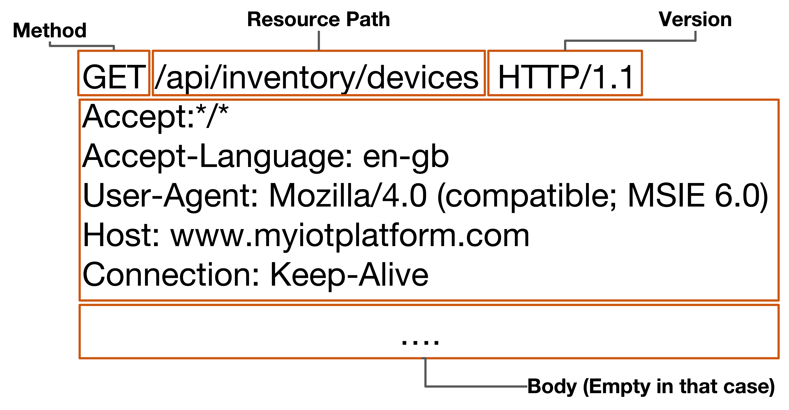

**Figure 4.1:** The structure of an HTTP request message (GET in this example).

The **HTTP request message** is a fundamental element when **modeling client-server communication** in web and IoT systems. It represents how a **client** (such as a browser, mobile app, or IoT device) initiates interaction with a **server** to **retrieve**, **update**, or **manipulate resources**. In IoT architectures, HTTP is commonly used for **RESTful APIs**, enabling standardized and efficient management of device data and services. The HTTP request message initiates a communication from a client (such as a browser or IoT device) to a server, asking for a specific resource or instructing the server to perform an action. In the context of IoT, HTTP is often used for RESTful APIs to manage and retrieve device information and other resources efficiently.

**Main Structure and Fields**

The figure breaks down the request into distinct parts:

- **Method**: Indicates the action to be performed by the server, such as `GET`, `POST`, `PUT`, or `DELETE`. In this example, `GET` requests data from the specified resource.
- **Resource Path**: Specifies the endpoint or location of the resource, here `/api/inventory/devices`, which typically points to device inventory data in an IoT platform.
- **Version**: States the version of HTTP being used, such as `HTTP/1.1`, which signals to the server the protocol features available.
- **Header Fields**: Include metadata and supplementary information about the request, such as:
  - `Accept`: Defines acceptable response content types.
  - `Accept-Language`: Sets preferred language (e.g., `en-gb`).
  - `User-Agent`: Identifies the client making the request.
  - `Host`: Indicates the domain of the server.
  - `Connection`: Manages session persistence (e.g., `Keep-Alive`).
- **Body**: The request body transmits additional data with the request, typically used with methods like `POST` or `PUT`. In a `GET` request such as this, the body is empty.

**Summary of HTTP Request Fields**

| Field            | Description                                         | Example Value                     |
|------------------|-----------------------------------------------------|-----------------------------------|
| Method           | Request operation (action)                          | GET                               |
| Resource Path    | Target resource on server                           | /api/inventory/devices            |
| HTTP Version     | Protocol version used                               | HTTP/1.1                          |
| Accept           | Acceptable response content types                   | */*                               |
| Accept-Language  | Preferred language for response                     | en-gb                             |
| User-Agent       | Client identity                                     | Mozilla/4.0 (compatible; MSIE 6.0)|
| Host             | Server domain                                       | www.myiotplatform.com             |
| Connection       | Session control                                     | Keep-Alive                        |
| Body             | Additional data (usually empty in GET)              |                                   |

---

## 4.2.2 The Structure of an HTTP Message - The Response Message - GET

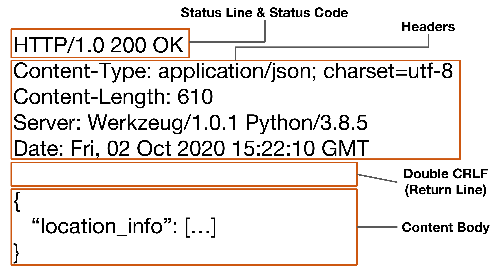

**Figure 4.2:** The structure of an HTTP response message (GET in this example).

The **HTTP response message** is a crucial component in **modeling client-server interactions** within web and IoT systems. It represents how a **server** responds to a **client's request**, providing the requested data, status information, and additional context. In IoT architectures, HTTP responses are often used in **RESTful APIs** to deliver device data, confirm actions, or report errors.
The HTTP response provides the client with the outcome of its request, including status information, metadata, and the actual requested content. In IoT and web applications, this enables clients to process results—such as resource data, error diagnostics, or service confirmations—in a standardized way.

**Main Structure and Fields**

The figure divides the response into these distinct elements:

- **Status Line & Status Code**: This line communicates the protocol version (`HTTP/1.0`), a numeric status code (`200`), and a brief message (`OK`). For example, `200 OK` means the request succeeded.
- **Headers**: These contain metadata about the response, such as:
  - `Content-Type`: Specifies the data format of the response body (e.g., `application/json; charset=utf-8`).
  - `Content-Length`: States the size of the response body in bytes.
  - `Server`: Identifies the software handling the response.
  - `Date`: Provides the timestamp when the response was issued.
- **Double CRLF (Return Line)**: This empty line marks the end of headers and the start of the content body.
- **Content Body**: Contains the actual data returned by the server for the request (here, a JSON object with a `location_info` field).

**Summary Table: HTTP Response Fields**

| Field Type           | Description                                           | Example Value                               |
|----------------------|-------------------------------------------------------|---------------------------------------------|
| Status Line          | Protocol version, status code, textual message        | HTTP/1.0 200 OK                             |
| Content-Type         | Format and encoding of returned content               | application/json; charset=utf-8             |
| Content-Length       | Size of response content body                         | 610                                         |
| Server               | Server software/version info                          | Werkzeug/1.0.1 Python/3.8.5                 |
| Date                 | Timestamp of response                                 | Fri, 02 Oct 2020 15:22:10 GMT               |
| Content Body         | Requested data or output (after headers)              | { "location_info": [...] }                  |

This structure ensures that client applications can reliably interpret server responses, validate results, and process returned data, enabling robust interactions in IoT and web platforms.

---

## 4.2.3 The Structure of an HTTP Message - The Request Message - POST

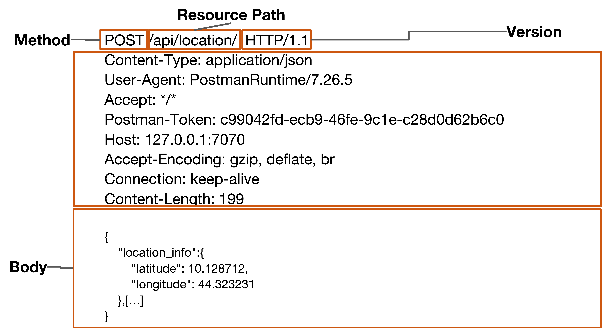

**Figure 4.3:** The structure of an HTTP request message (POST in this example).

This figure illustrates the **structure** and **main fields** of an HTTP **POST request message**, which is essential for **modeling data submission** and **resource creation** in web and IoT systems.

In the context of **system modeling**, the **HTTP POST request** enables a **client** (such as an IoT device or web application) to **transmit data**—for example, **sensor readings** or **device status**—to a **server** for **processing**, **storage**, or further **computation**. Unlike a **GET request**, which is used to **retrieve data**, the **POST method** is designed to **actively send new information**, supporting scenarios where devices need to **create** or **update resources** on the server.

By clearly defining the **method**, **resource path**, **headers**, and **body**, the POST request provides a **standardized framework** for modeling **interoperable** and **scalable APIs**. This approach ensures that diverse clients can reliably submit structured data, facilitating robust integration and efficient management of resources in distributed IoT and web architectures.

**Main Structure and Fields**

The POST request, as shown, is made up of the following parts:

- **Method**: Specifies the action to be performed on the resource, here `POST`, indicating data submission or resource creation.
- **Resource Path**: Defines the target endpoint `/api/location/` where the server expects the new data.
- **HTTP Version**: Indicates the communication protocol version (e.g., `HTTP/1.1`).
- **Header Fields**: Provide metadata and control information about the request, such as:
  - `Content-Type`: Declares the format of the sent data (`application/json`).
  - `User-Agent`: Identifies the software client sending the request.
  - `Accept`: States the formats the client can handle in the response.
  - `Postman-Token`: Used for request tracking, especially in testing environments.
  - `Host`: The IP or domain of the target server.
  - `Accept-Encoding`: Indicates supported compression methods.
  - `Connection`: Manages session persistence (e.g., `keep-alive`).
  - `Content-Length`: Specifies the byte length of the accompanying body.
- **Body**: Contains the primary data payload being sent, such as:
  - A JSON object with location information (latitude and longitude).

**Summary Table: HTTP POST Request Fields**

| Field Name        | Purpose/About                              | Example Value                         |
|-------------------|--------------------------------------------|---------------------------------------|
| Method            | HTTP operation to execute                  | POST                                  |
| Resource Path     | API endpoint or target resource            | /api/location/                        |
| HTTP Version      | Protocol version                           | HTTP/1.1                              |
| Content-Type      | Format of sent data                        | application/json                      |
| User-Agent        | Client software identification             | PostmanRuntime/7.26.5                 |
| Accept            | Acceptable response formats                | */*                                   |
| Postman-Token     | Request tracking (testing tool)            | c99042fd-...-c28d0d62b6c0             |
| Host              | Server domain/IP and port                  | 127.0.0.1:7070                        |
| Accept-Encoding   | Supported compression                      | gzip, deflate, br                     |
| Connection        | Session persistence                        | keep-alive                            |
| Content-Length    | Size of the request body in bytes          | 199                                   |
| Body              | Data sent to server                        | {location_info:{...}}                 |

This structure enables flexible data communication in web and IoT systems, allowing clients to supply new or updated information to servers in a standardized, reliable manner.

---

## 4.2.4 The Structure of an HTTP Message - The Response Message - POST

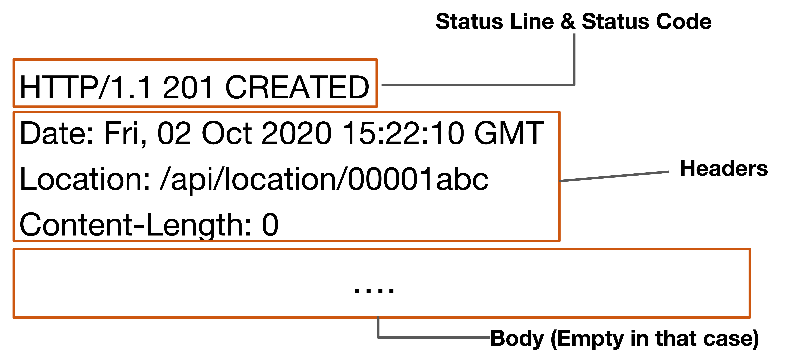

**Figure 4.4:** The structure of an HTTP response message (POST in this example).

When **modeling client-server interactions** in web and IoT systems, the **HTTP POST response** plays a crucial role in confirming the outcome of a **data submission** or **resource creation** operation. Upon successful creation, the server returns a **201 (Created) status code**, signaling that the client's request resulted in a new resource. The response includes the **Location header**, which provides the **URI of the newly created resource**, enabling clients to reference, retrieve, or further interact with it. Minimal metadata—such as the **Date** and **Content-Length**—is typically included, ensuring efficient communication. This standardized response structure supports **interoperability** and **robust modeling** of RESTful APIs, allowing diverse clients to reliably interpret the results of their POST operations.

**Main Structure and Fields**

The response consists of these vital parts:

- **Status Line & Status Code**: Communicates the HTTP protocol version (`HTTP/1.1`), a numeric status (`201`), and message (`CREATED`), indicating successful resource creation.
- **Headers**: Provide essential information about the response.
  - `Date`: Timestamp of response generation.
  - `Location`: Identifies the newly created resource’s endpoint (e.g., `/api/location/00001abc`), enabling clients to retrieve, update, or interact with this resource.
  - `Content-Length`: The size of the content body, usually `0` in simple POST responses without additional response data.
- **Body**: May be empty, as in this example, when the server does not return further content.

**Summary Table: HTTP POST Response Fields**

| Field Name       | Purpose/About                                   | Example Value                  |
|------------------|-------------------------------------------------|-------------------------------|
| Status Line      | Indicates outcome of the POST request           | HTTP/1.1 201 CREATED          |
| Date             | Server’s timestamp of response                  | Fri, 02 Oct 2020 15:22:10 GMT |
| Location         | URI of the created resource                     | /api/location/00001abc        |
| Content-Length   | Number of bytes in response body                | 0                             |
| Body             | Additional returned data (empty in this case)   | ...                           |

This response structure communicates to the client that the data sent was processed, a new resource was created, and where it can be accessed, supporting robust and standardized client-server interactions in RESTful and IoT environments.

> **Note:** In the previous sections we analyzed just two HTTP methods: **GET** and **POST**. However, there are other important methods such as **PUT**, **DELETE**, **PATCH**, and **OPTIONS** that are also widely used in RESTful APIs. Each method serves a specific purpose in resource management and manipulation, contributing to the overall functionality and flexibility of web and IoT applications. We will investigate these other methods in rest of the lecture and in particular with respect to the usage of the RESTful paradigm with HTTP.

---

## 4.2.5 The Web as a Platform

The **web** was originally designed as an **easy-to-use**, **distributed**, and **loosely coupled system** for sharing documents and information. Its **architecture** is intentionally **simple**, enabling rapid development of applications and straightforward management of content. The web relies on a **small set of core principles**—such as **uniform resource identification**, **stateless communication**, and **standardized protocols**—which have allowed it to **scale** and **evolve** to meet the demands of billions of users and devices.

Over time, the web has transformed into a **platform for building distributed systems**, supporting a wide range of applications beyond document sharing. **Distributed applications** leverage **HTTP** (RFC 2616) as their foundational protocol, enabling **interoperability**, **modularity**, and **scalability** across diverse environments.

When **modeling distributed applications** on the web, it is essential to address requirements such as **resource identification**, **stateless interactions**, **standardized communication patterns**, and **scalable integration**. These needs naturally lead to architectural approaches that support **flexibility**, **interoperability**, and **efficient resource management**—setting the stage for more advanced paradigms that address these requirements in a systematic way.

> There was the need for a more structured approach to designing web-based distributed systems, which led to the development of the **REST architectural style**. REST provides a set of guiding principles and constraints that help model scalable, maintainable, and efficient web services, making it easier to build applications that can grow and adapt over time.

---

# 4.3 REpresentational State Transfer (REST) Architectural Style

**REST** is the **architectural style** that underpins the **World Wide Web**, providing a systematic approach for **modeling distributed systems** and **web applications**. Introduced by **Roy Fielding** in his 2000 Ph.D. dissertation, *"Architectural Styles and the Design of Network-based Software Architectures"*, REST establishes a set of **rules** and **principles** that guide the design of scalable, robust, and maintainable networked applications.

When **modeling web-based systems** using REST, you focus on:

- **Scalability**: Supporting a large number of **interacting clients** and devices efficiently.
- **Robustness**: Ensuring the system can **evolve** and **adapt** over time without breaking existing functionality.
- **Interoperability**: Facilitating seamless communication between **heterogeneous components** and platforms.
- **Simplicity**: Promoting **easy-to-understand** interactions and **stateless communication**.

**Key REST Modeling Principles:**

- **Uniform Interface**: Standardizes how clients interact with resources, simplifying integration and reducing coupling.
- **Statelessness**: Each request contains all necessary information, enabling scalability and reliability.
- **Resource-Based Modeling**: Everything is treated as a **resource** with a unique identifier (URI), making the system modular and extensible.
- **Representation**: Resources are exchanged using standard formats (e.g., JSON, XML), supporting flexible data modeling.
- **Layered System**: Components are organized in layers, improving scalability and security.

> By adhering to REST principles, you can **model web applications** that are **scalable**, **robust**, and **easy to maintain**, laying the foundation for modern distributed systems and IoT platforms.


---

## 4.3.1 The concept of Resource in REST

In **RESTful modeling**, the concept of a **resource** is fundamental. A **resource** represents any significant entity within an application's domain that is exposed and manipulated via the web. Resources are the building blocks of REST architectures, providing a standardized way to model and interact with application data.

**Key characteristics of resources in REST:**

- **Domain-Relevant Entity**: A resource can be anything meaningful in your application—such as a **webpage**, a **video**, a **user profile**, or an **order** in an e-commerce system.
- **User Interaction**: Resources are entities with which users interact to achieve specific goals (e.g., viewing a product, placing an order, updating a profile).
- **Universal Mapping**: Any aspect of an application's domain can be modeled as a resource, making REST highly flexible and extensible.
- **Data Representation**: Each resource is characterized by associated data (for example, the **title** of a page, the **items** in an order, or the **attributes** of a user).
- **Identification via URI**: Every resource is uniquely identified by a **Uniform Resource Identifier (URI)**, which serves as its address on the web. This allows clients to locate and interact with resources easily.

An example of a REST resource modeling in the IoT can be as reported in the following table:

| Resource Type       | Description                                       | Example URI                          |
|---------------------|---------------------------------------------------|--------------------------------------|
| Device              | Represents an IoT device                          | /iot/devices/123                     |
| Sensor              | Represents a sensor within a device               | /iot/devices/123/sensors/456         |
| Actuator            | Represents an actuator within a device            | /iot/devices/123/actuators/789       |
| User                | Represents a user interacting with the IoT system | /iot/users/abc                       |
| Data Stream         | Represents a data stream from a sensor            | /iot/devices/123/sensors/456/data    |
| Configuration       | Represents device configuration settings          | /iot/devices/123/configuration       |

> In summary, **REST models everything as a resource**, enabling a uniform, scalable, and modular approach to designing web-based and distributed systems.

---

## 4.3.2 Differences with Other Architectural Styles

When **modeling distributed systems**, it is essential to understand how **REST** differs from other architectural styles, such as **Remote Procedure Call (RPC)** and **Service-Oriented Architecture (SOA)**. Each style has its own principles and approaches to structuring interactions between components, which can significantly impact the design and functionality of the system.

**Remote Procedure Call (RPC)** 

The RPC focuses on invoking methods or functions on remote systems as if they were local. This approach often leads to **tighter coupling** between client and server, as the client must be aware of the server's interface and method signatures. RPC can be less flexible and harder to scale, especially in dynamic environments where services may change frequently.

An example of RPC protocols includes **gRPC** and **XML-RPC** and can be quickly summarized as follows with an IoT example:

Suppose an IoT client wants to remotely turn on a smart light. Using an RPC protocol (e.g., gRPC), the client sends a method call like `TurnOnLight(device_id: "light-001")` to the server. The server executes the function and returns a result (e.g., success/failure). This direct invocation abstracts the network communication, making remote actions appear as local function calls.

**Service-Oriented Architecture (SOA)**

SOA emphasizes the use of **loosely coupled services** that communicate over a network. Services in SOA are designed to be reusable and can be orchestrated to perform complex workflows. While SOA promotes modularity and reusability, it can introduce complexity due to service contracts and the need for service discovery mechanisms.

An example of SOA protocols includes **SOAP** and **WSDL** and can be summarized as follows with an IoT example:

In an IoT scenario, a SOA-based system might have a service for managing device configurations. A client could send a SOAP request to the `DeviceConfigService` to update the settings of a specific device. The service processes the request and returns a SOAP response indicating the success or failure of the operation. This approach allows for clear service definitions and interactions but may involve more overhead compared to REST.

**Comparison Table**

| Aspect                     | REST                                             | RPC                                              | SOA                                             |
|----------------------------|--------------------------------------------------|--------------------------------------------------|-------------------------------------------------|
| **Interaction Model**      | Resource-based, stateless interactions           | Function/method calls, often stateful            | Service-based, can be stateful or stateless      |
| **Coupling**               | Loose coupling through standard interfaces       | Tight coupling due to direct method calls        | Moderate coupling, services can be independently deployed |
| **Scalability**            | Highly scalable due to statelessness             | Less scalable, stateful interactions can limit scalability | Scalable, but depends on service design          |
| **Flexibility**            | High flexibility with resource representations   | Less flexible, tied to specific method signatures | Flexible, but can be complex due to service contracts |
| **Standardization**        | Uses standard HTTP methods and status codes      | No standard protocol, varies by implementation | Often uses SOAP or REST, but can be complex      | 
| **Complexity**             | Simpler, with fewer constraints                  | Can be complex due to method definitions         | Can be complex due to service orchestration      | 
| **Use Cases**              | Web applications, IoT, mobile apps               | Legacy systems, tightly coupled applications     | Enterprise applications, complex workflows       |

> In summary, **REST** offers a **resource-oriented**, **stateless**, and **scalable** approach to modeling distributed systems, making it well-suited for modern web and IoT applications. In contrast, **RPC** focuses on direct method calls, often leading to tighter coupling, while **SOA** emphasizes service-based interactions that can introduce complexity. Understanding these differences is crucial for selecting the appropriate architectural style for your specific application needs.

---

## 4.3.3 A Simple Comparison Between REST and SOAP

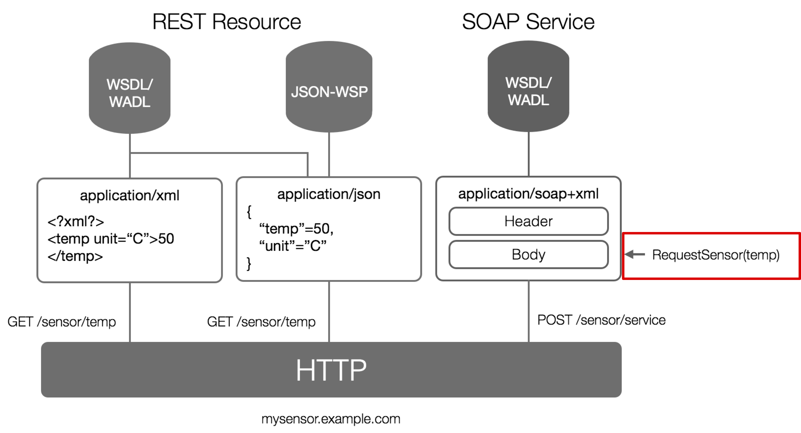

**Figure 4.5:** A simple comparison between REST and SOAP.

The figure compares REST and SOAP web service models, highlighting key distinctions in architecture, data formats, and messaging approaches[1].

**REST Resource**

- **Endpoints and Operations**: REST uses simple URI endpoints (e.g., `/sensor/temp`) and HTTP methods such as `GET` for retrieving data.
- **Data Formats**: REST supports various representations, commonly `application/json` and sometimes `application/xml`. JSON is lightweight, widely used for IoT and web APIs, while XML can be employed when needed[1].
- **Description and Discovery**: It may utilize WSDL (Web Services Description Language), WADL (Web Application Description Language), or JSON-WSP for service definition, though these are optional within RESTful design[1].
- **Interaction Style**: REST is stateless, typically lightweight, with direct mappings between HTTP methods and CRUD operations[1].

**SOAP Service**

- **Endpoints and Operations**: SOAP packages requests into structured envelopes sent to service endpoints (e.g., `/sensor/service`), often using the HTTP `POST` method.
- **Data Formats**: SOAP defines strict messaging using `application/soap+xml`, where each message has two sections: a header and a body. The body contains function call and parameter data (here, `RequestSensor(temp)`)[1].
- **Description and Discovery**: SOAP relies heavily on WSDL for automatic service description and client generation[1].
- **Interaction Style**: SOAP is protocol-heavy, including built-in standards for security, reliability, and transactional processing—making it suitable for complex enterprise scenarios but less ideal for lightweight IoT and web applications[1].

**Comparative Table**

| Aspect             | REST                              | SOAP                               |
|--------------------|-----------------------------------|------------------------------------|
| Endpoint Example   | /sensor/temp                      | /sensor/service                    |
| HTTP Verb          | GET, POST, PUT, DELETE            | Typically POST                     |
| Data Format        | JSON, XML                         | SOAP XML (Header + Body)           |
| Description        | Optional WSDL/WADL/JSON-WSP       | Mandatory WSDL                     |
| Structure          | Resource-oriented, lightweight     | Strict envelope, protocol-heavy    |
| Typical Use        | IoT, Web APIs, Mobile clients     | Enterprise, transaction-heavy APIs |

**Key Differences**

- REST emphasizes simplicity, direct resource manipulation, and flexibility in data formats—ideal for scalable web and IoT APIs.
- SOAP is more regimented, suitable for situations demanding comprehensive standards (security, transactions), but less efficient for modern web and IoT application needs[1].

---

## 4.3.4 The Client Perspective REST vs. SOAP

When **modeling client-server interactions**, the choice between **REST** and **SOAP** can significantly impact the design and functionality of the system. From a **client perspective**, several factors should be considered.

When interacting with a server, the client must be aware of certain foundational concepts to ensure effective communication and correct operation.

**Client-Server Interaction Essentials**

- **Protocol Compliance**: The client must use the appropriate protocol and adhere strictly to its message structure and semantics (e.g., HTTP methods like GET, POST, headers, and body formats).
- **Resource or Service Addressing**: Clients should know the exact URI or endpoint to target based on the service or resource to be accessed.
- **Request Metadata**: Proper headers such as `Content-Type`, `Accept`, and authentication tokens if necessary must be included to ensure the server understands the request context.
- **Response Handling**: Clients should interpret diverse response status codes and payloads to process results or errors adequately.

**Conceptual Differences: Resource vs Service-Based Approaches**

- **Resource-Centric Model (e.g., REST)**:
  - Represents everything as resources addressed by **URIs**.
  - A **resource** is an entity (like a sensor, device, or location) on which multiple standard actions (CRUD - Create, Retrieve, Update, Delete) can be performed using HTTP methods.
  - This model is **intuitive**, **scalable**, and **easy to navigate** because the client interacts primarily by addressing resources and selecting desired operations.
  - Clients **do not need deep knowledge** about specific actions beyond standard methods; **they explore or manipulate resources directly**.

- **Service-Oriented Model (e.g., SOAP)**:
  - Emphasizes **services** that expose specific operations or methods (like `RequestSensor(temp)`).
  - Services often require **detailed contract definitions** (e.g., WSDL) that specify all available operations, input, and output parameters.
  - **Clients must have additional knowledge** about the available services, operation names, expected message formats, and how to compose requests accordingly.
  - This model is powerful for **complex, transactional, or secure workflows but introduces more complexity for the client**.

In simple terms, a resource-centric approach like REST focuses on addressing and manipulating entities with uniform methods, promoting ease of use and scalability. A service-based approach like SOAP defines a catalog of operations that clients invoke, requiring richer client-side knowledge about the service contract. Clients aiming to interact with a server must appreciate these distinctions to prepare correct requests, handle responses, and maintain compatibility with the server’s communication model.

> **Note:** From an IoT perspective, REST is often preferred for its simplicity, scalability, and alignment with web standards, making it suitable for resource-constrained devices and dynamic environments. SOAP may be chosen in scenarios demanding strict security, reliability, or complex transactions, typically in enterprise settings. However, REST's lightweight nature and ease of integration with modern web technologies often make it the go-to choice not only for IoT but also for web and mobile applications.

---

## 4.3.5 REST Main Characteristics

When **modeling REST architectures**, several core characteristics and principles guide the design of scalable, interoperable, and maintainable systems:

- **Client-Server Model**:  
  - **Clients** (user agents, such as browsers or IoT devices) act as the application interface, initiating interactions by sending requests.
  - **Servers** (origin servers) host **resources** and respond to client requests, managing data and business logic.
  - This **separation of concerns** ensures that clients and servers have distinct, limited responsibilities, promoting modularity and independent evolution.

- **Intermediaries**:  
  - **Forward proxies** (known to clients) serve as “exit points” for requests, often used for caching, filtering, or access control.
  - **Reverse proxies** appear as origin servers to clients but relay requests to actual servers, enabling load balancing, security, and scalability.
  - Intermediaries can act as both clients and servers, enhancing flexibility and robustness in distributed system modeling.

- **Uniform Interface**:  
  - All connectors within the system must conform to a standardized interface, which simplifies integration and interaction.
  - **Key constraints of the uniform interface**:
    - **Identification of resources**: Every resource is uniquely identified by a URI, enabling consistent addressing and manipulation.
    - **Manipulation of resources through representations**: Clients interact with resources by exchanging representations (e.g., JSON, XML), allowing for flexible data modeling.
    - **Self-descriptive messages**: Each message contains all necessary information for processing, supporting stateless communication and interoperability.
    - **Hypermedia as the engine of application state (HATEOAS)**: Clients navigate the application dynamically using hyperlinks provided in resource representations, enabling discoverability and adaptability.

- **Statelessness**:  
  - Each request from a client to a server must contain all the information needed to understand and process the request.
  - The server does not store any client context between requests, which enhances scalability and reliability.
  - This statelessness allows servers to handle a large number of requests efficiently, as they do not need to maintain session information.
  - Clients may manage state locally or through tokens, but the server remains stateless.
  - Stateless interactions simplify server design and improve fault tolerance.
  - It is a great benefit also for the IoT, where devices may have limited resources and intermittent connectivity.

> By adhering to these principles, RESTful modeling achieves **scalability**, **simplicity**, and **interoperability**, making it a foundational approach for modern web and IoT systems.
> Using a **stateless** architecture allows for easier scaling and reliability, as servers do not need to maintain session information between requests. This is particularly beneficial in distributed systems where clients may be numerous and transient.

---

## 4.3.6 REST & Resource Representation

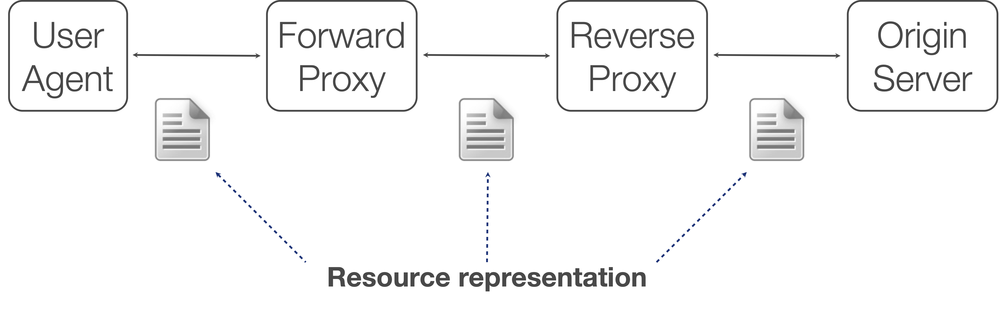

**Figure 4.6:** REST & Resource Representation also with forward and reverse proxies.

When **modeling RESTful systems**, it is crucial to understand that **resources themselves are never exchanged directly** between endpoints. Instead, what is transferred is a **representation** of a resource—a snapshot or view of its state at a specific moment.

**Key characteristics of resource representation in REST modeling:**

- **Representation**:  
  - A representation is a **transformation or view** of a resource’s current state.
  - It is encoded in a **transferable format** such as **JSON**, **XML**, **XHTML**, **Atom**, **plain text**, **CSV**, **MP3**, or **JPEG**.
- **Serialization/Deserialization**:  
  - Each endpoint must **serialize** (convert resource state to a transferable format) before sending and **deserialize** (convert back to usable data) upon receiving.
- **Decoupling**:  
  - This approach **decouples the internal resource model** from its external representation, allowing flexibility in how resources are exposed and consumed.
- **Multiple Representations**:  
  - The same resource can have **multiple representations** (e.g., a device’s data as JSON for APIs, or as HTML for web dashboards), supporting diverse client needs.

> In RESTful modeling, always remember: **what is exchanged are representations, not the resources themselves**. This principle enables interoperability, extensibility, and efficient communication across heterogeneous systems.

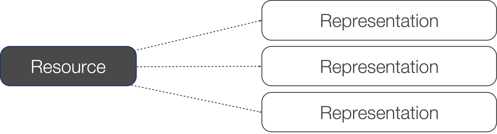

**Figure 4.7:** From 1 resource to N representations.

When **modeling RESTful systems**, it is essential to understand that what is actually exchanged between **clients** and **servers** is a **representation** of a resource—not the resource itself.

**Core characteristics:**
- A **resource** is an abstract entity identified by a **URI**; its **representation** is a concrete, transferable format (such as **JSON**, **XML**, or **HTML**) that describes its current state.
- The **same resource** can have **multiple representations** (**1:N relationship**), allowing different clients to consume the resource in the format best suited to their needs.
- For **clarity and compactness**, we will refer to the **representation of a resource** simply as a **resource** in the following sections—but always remember the distinction between the abstract resource and its concrete representation.

> **Key modeling takeaway:** Always model interactions in REST as exchanges of resource representations, enabling flexibility, interoperability, and support for diverse client requirements.

---

## 4.3.7 REST Resource Identifier & URI

In **RESTful modeling**, the concept of a **Uniform Resource Identifier (URI)** is fundamental for uniquely identifying and interacting with resources across a distributed system. URIs provide a **standardized mechanism** to address, locate, retrieve, and manipulate resources, ensuring interoperability and clarity in resource management.

**Key characteristics of URIs in RESTful modeling:**

- **Unique Identification**:  
  - Every resource in a RESTful system is assigned a unique URI, guaranteeing that clients and servers can unambiguously reference and interact with the correct entity.
- **Standardization**:  
  - URIs follow the syntax and rules defined in [RFC 3986](https://datatracker.ietf.org/doc/html/rfc3986), promoting consistency and compatibility across platforms and applications.
- **Addressability**:  
  - A URI acts as the address for a resource, enabling clients to locate, retrieve, and manipulate it over the network.
- **Mapping**:  
  - While a resource can be mapped to multiple URIs (for different representations or access paths), each URI points to exactly one resource, ensuring precise targeting.
- **Types of URIs**:  
  - **URL (Uniform Resource Locator)**: Specifies how to locate a resource, including the protocol and path (e.g., `http://mydomain.it/people/123`).
  - **URN (Uniform Resource Name)**: Specifies the name of a resource, independent of its location (e.g., `urn:ietf:rfc:2616`).

> **Modeling takeaway:**  
> When designing RESTful systems, always use URIs to uniquely and consistently identify resources. This approach enables scalable, interoperable, and maintainable architectures, where every resource is easily addressable and accessible.

---

## 4.3.8 REST & URI Example

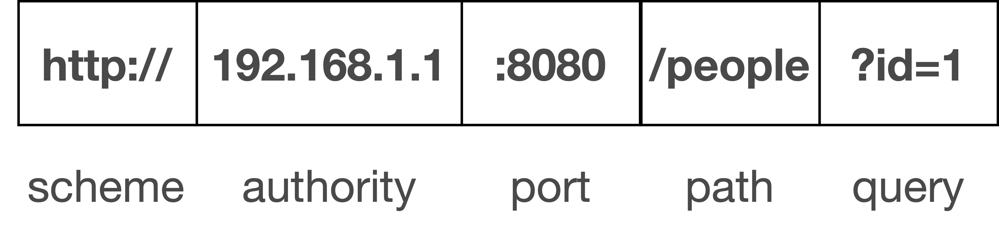

**Figure 4.8:** REST Resource Identifier & URI Example.

In **RESTful modeling**, understanding the structure and semantics of **URIs** is essential for designing scalable and interoperable systems. A URI is composed of two main parts:

- **Scheme**: Specifies the protocol or method used to interpret the rest of the URI (e.g., `http`, `https`, `urn`).
- **Scheme-Specific Part**: Contains all information necessary to locate or identify the resource.

**Key URI Types in Modeling:**

- **URN (Uniform Resource Name)**: Uses the `urn` scheme and provides a unique, location-independent identifier for a resource. It is ideal for modeling resources that need persistent, global identification regardless of their network location.
- **URL (Uniform Resource Locator)**: Includes all details required to successfully address and access a resource over the network. URLs are commonly used in RESTful APIs to model endpoints for resource interaction.

**URI Components in REST**

- **Scheme**: The protocol used to access the resource—in this case, `http://`. REST APIs frequently use HTTP or HTTPS as the scheme to ensure standardized client-server communication.
- **Authority**: Refers to the domain or IP address hosting the resource—here, `192.168.1.1`. This is essential for routing requests to the correct server.
- **Port**: Specifies the network port (`:8080`) on which the server is listening. REST endpoints may be exposed on custom ports depending on application requirements.
- **Path**: Identifies the specific resource being addressed (e.g., `/people`). This segment is key in REST, as resources are accessed and manipulated directly via their path.
- **Query**: Provides additional parameters to refine the request (`?id=1`). In REST, queries commonly filter, sort, or select specific representations of the resource addressed by the path.

**Comment on REST URI Usage**

When **modeling RESTful APIs**, the design of **URIs** is central to achieving clarity, scalability, and intuitive interaction with resources. REST relies on **well-structured, meaningful URIs** to expose resources and support efficient client-server communication.

**Core modeling characteristics of REST URI design:**

- **Resource Mapping**:  
  - Each **resource** (e.g., a person, device, or sensor) is assigned a **unique path** within the URI, making endpoints easy to discover and understand.
- **Scheme and Authority**:  
  - The **scheme** (`http`, `https`) and **authority** (domain or IP) components ensure the service is **network-accessible** and clearly identified.
- **Path Structure**:  
  - The **path** segment of the URI directly reflects the resource hierarchy and relationships, supporting **modular** and **extensible** API modeling.
- **Query Parameters**:  
  - **Query parameters** provide **flexibility** by allowing clients to filter, sort, or request specific representations of resources without changing the endpoint structure.
- **Scalability and Clarity**:  
  - This approach enables **scalable** API design, where new resources and operations can be added without disrupting existing endpoints.
  - **Clear URI conventions** make it straightforward for developers and clients to interact with the API, reducing ambiguity and improving maintainability.

> In summary, **RESTful URI modeling** emphasizes unique, descriptive, and hierarchical paths, combined with flexible query parameters, to create APIs that are both **intuitive** and **scalable**. This structured methodology ensures that resources are easily addressable and interactions remain consistent across distributed systems.

---

## 4.3.9 URI & Representations

When **modeling RESTful systems**, it is essential to treat **URIs as opaque identifiers**—they should not reveal or encode the **representation format** (such as `.json` or `.xml`) within the URI itself. Instead, the **representation type** is negotiated and specified using **HTTP headers**, ensuring clean separation between resource identification and data format.

**Core characteristics of RESTful URI modeling:**

- **Opaque URIs**:  
  - URIs should uniquely identify resources without exposing implementation details or representation formats.
- **Content Negotiation**:  
  - The **Content-Type** and **Accept** headers in HTTP requests and responses are used to specify and negotiate the desired representation (e.g., JSON, XML).
- **Decoupling**:  
  - This approach decouples resource identification from representation, supporting extensibility and interoperability.

**Bad Practice Example (to avoid):**
- `http://mydomain.it/123.xml`
- `http://mydomain.it/123.json`

These URIs encode the representation format in the path, which is discouraged in RESTful modeling.

**Recommended Practice:**
- Use a single URI for the resource (e.g., `http://mydomain.it/123`)
- Specify the desired representation using HTTP headers.

**Example: Requesting the Same Resource in Different Formats**

**Request 1: JSON Representation**
```http
GET /123 HTTP/1.1
Host: mydomain.it
Accept: application/json
```
**Response 1:**
```http
HTTP/1.1 200 OK
Content-Type: application/json

{
  "id": 123,
  "name": "Temperature Sensor",
  "value": 22.5
}
```

**Request 2: XML Representation**
```http
GET /123 HTTP/1.1
Host: mydomain.it
Accept: application/xml
```
**Response 2:**
```http
HTTP/1.1 200 OK
Content-Type: application/xml

<sensor>
  <id>123</id>
  <name>Temperature Sensor</name>
  <value>22.5</value>
</sensor>
```

> **Modeling takeaway:**  
> Always keep **URIs opaque** and use **HTTP headers** for content negotiation. This ensures clean, scalable, and interoperable RESTful APIs where clients can request the same resource in multiple formats without changing the URI structure.

---

## 4.3.10 REST & Statelessness

When **modeling RESTful systems**, the principle of **statelessness** is fundamental and shapes how client-server interactions are designed. In a **stateless REST architecture**, every request from a client must be **self-contained**—carrying all the information the server needs to process it, without relying on any previous interactions or stored context.

**Core characteristics of stateless REST modeling:**

- **Self-Descriptive Messages**:  
  Each request is **self-descriptive**, including all necessary data (such as authentication, resource identifiers, and parameters) so the server can process it independently.
- **No Session State on Server**:  
  The server does **not maintain session state** or client context between requests. There is no concept of a persistent “session”; all state is managed by the client and transmitted as part of each request.
- **No Reliance on Cookies**:  
  REST discourages the use of cookies or other mechanisms that create server-side session state. This keeps interactions stateless and scalable.
- **Client State in Requests**:  
  Any required **client state** (such as authentication tokens or resource references) must be included in the request itself, relieving the server from tracking client-specific data.
- **Scalability and Reliability**:  
  Statelessness enables **horizontal scaling** and improves reliability, as servers can handle requests independently and efficiently, without complex session management.

> **Modeling takeaway:**  
> By enforcing statelessness, RESTful systems achieve **simplicity**, **scalability**, and **robustness**. Each interaction is atomic and independent, making distributed systems easier to scale and maintain.

---

## 4.4 REST Maturity Levels

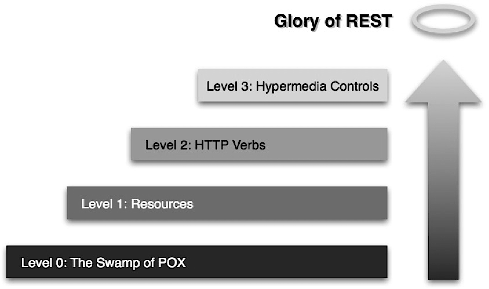

**Figure 4.9:** REST Maturity Levels.

When **modeling RESTful systems**, understanding the concept of **REST maturity levels** is essential for evaluating and improving the design of web services. These levels provide a framework for assessing how closely an API aligns with **RESTful principles**, guiding architects and developers toward more scalable, maintainable, and interoperable solutions.

**REST Maturity Levels: Modeling Perspective**

- **Classification**: REST maturity levels categorize web applications based on their degree of compliance with REST principles.
- **RESTfulness**: The higher the level, the more **RESTful** and loosely coupled the application is.
- **Coupling**: Lower coupling between clients and servers enables **independent evolution**, scalability, and easier maintenance.
- **Modeling Guidance**: By identifying the current maturity level, you can systematically improve your API design to better leverage RESTful patterns.

**Core Characteristics of REST Maturity Levels:**

The **REST maturity model**, proposed by Leonard Richardson [Link](http://martinfowler.com/articles/richardsonMaturityModel.html), consists of four levels:

- **Level 0**: Single endpoint, single HTTP method, action-based payloads (RPC-style; tightly coupled).
- **Level 1**: Multiple endpoints representing resources, but still using a single HTTP method.
- **Level 2**: Multiple endpoints and full use of HTTP methods (GET, POST, PUT, DELETE) for resource manipulation.
- **Level 3**: Hypermedia controls (HATEOAS) embedded in resource representations, enabling dynamic client-server interactions.

> **Modeling takeaway:**  
> Striving for higher REST maturity levels reduces coupling, increases flexibility, and supports the independent evolution of distributed systems. This approach leads to APIs that are easier to scale, maintain, and integrate across diverse platforms.

---

### 4.4.1 Level 0: The Swamp of POX (Plain Old XML)  

At this level, the service adopts a **single endpoint** (commonly `/api` or `/service`) and relies on a **single HTTP method**—typically `POST`—to process all operations. The **payload** is usually **XML** or **JSON**, but there is **no use of HTTP methods or distinct URIs to represent resources**. This approach is often called **RPC-style** or **Plain Old XML (POX)**.

**Modeling Explanation:**
- The system uses **HTTP purely as a transport mechanism**, not as an application protocol. This means it does not leverage the core features of HTTP, such as resource identification, standard methods, or stateless interactions.
- **HTTP acts as a tunnel** for custom remote procedure calls (RPC), where the actual operation is described inside the payload rather than by the HTTP method or URI.
- **Why HTTP?** Ports **80/443** are typically open and considered safe by firewalls, making HTTP a convenient choice for communication, even if its semantics are ignored.

**Core Characteristics:**
- **Single Endpoint**: All requests are sent to one URI (e.g., `/api`).
- **Single HTTP Method**: Usually only `POST` is used for every operation.
- **Action-Based Payload**: The specific action to perform is described within the XML or JSON payload, not by the HTTP method or URI.
- **No Resource Modeling**: There is no concept of resources; everything is handled as a remote procedure call.
- **RPC Mechanism**: Clients send requests that trigger actions, with the operation details embedded in the payload.
- **Limited RESTfulness**: This level does not utilize RESTful principles, resulting in tight coupling and reduced scalability.

> **Modeling takeaway:**  
> Level 0 is essentially an RPC-over-HTTP approach, using HTTP for transport but not for application semantics. It lacks resource orientation, standard HTTP methods, and statelessness, making it inflexible and less scalable for modern web and IoT systems.

---

#### 4.4.1.1 Level 0 Example

In this example, we have a simple calendar service that allows clients to request events for a specific date. Communication occurs between a client and a web service. The client sends requests and receives responses as XML documents, but there is no resource-centric design or utilization of HTTP features beyond basic message delivery. The structure follows a single remote procedure-like entry point rather than multiple distinct resources.

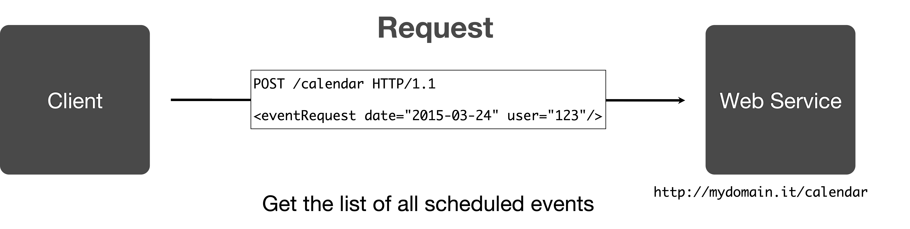

**Figure 4.10:** Level 0 Example - Reading Calendar Request.

For example for reading events on a specific date, the client sends an HTTP request, usually a POST to a single endpoint like `/calendar`. The request body contains an XML payload, for example:

```xml
<eventRequest date="2015-03-24" user="123"/>
```

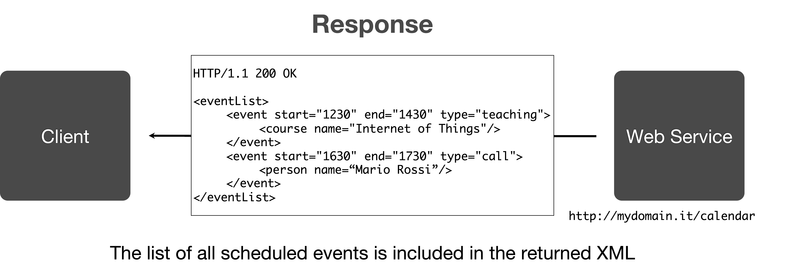

**Figure 4.11:** Level 0 Example - Calendar Event Response.

The server responds with an XML body:

```xml
<event start="1730" end="1800" type="meeting"/>
```

The response wraps data in XML but without leveraging HTTP status codes, verbs for actions, or addressable resources and force the client to be aware of the XML structure and semantics to understand the content considering that the same endpoint is used for all operations.

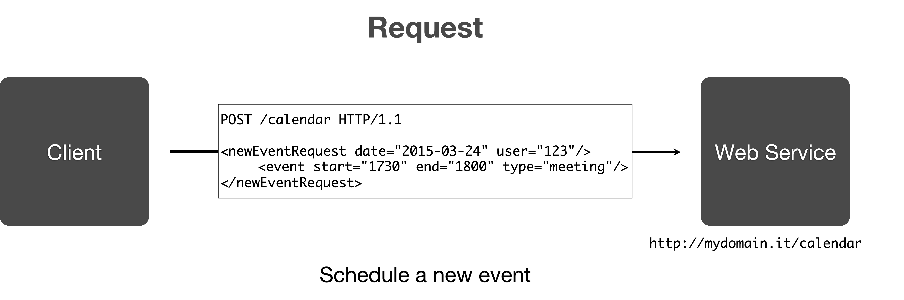

**Figure 4.12:** Level 0 Example - Creating a New Event Request.

Another example for creating a new event, the client sends:

```xml
<newEventRequest date="2015-03-24" user="123">
  <event start="1730" end="1800" type="meeting"/>
</newEventRequest>
```

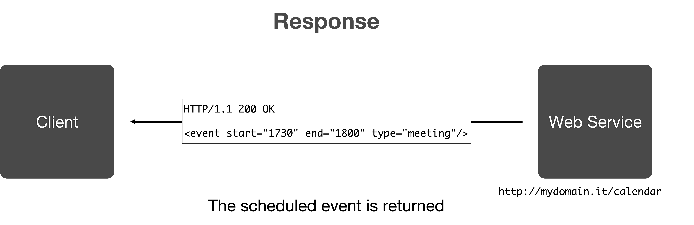

**Figure 4.13:** Level 0 Example - Creating a New Event Response.

The server responds with:

```xml
<eventList>
  <event start="1230" end="1430" type="teaching">
    <course name="Internet of Things"/>
  </event>
  <event start="1630" end="1730" type="call">
    <person name="Mario Rossi"/>
  </event>
</eventList>
```

Also in this case, the response wraps data in XML but without leveraging HTTP status codes, verbs for actions, or addressable resources. All operations access a single endpoint, such as `/calendar`, and **the meaning of each operation is embedded in the XML payload structure** rather than the request method or resource path.

---

#### 4.4.1.2 Level 0 Characteristics & Limitations

At **Level 0**, the service is modeled as a simple **RPC-over-HTTP** system, lacking true RESTful features. The focus is on **action-based messaging** rather than resource-oriented design, which introduces several limitations from a modeling perspective.

**Core Characteristics:**

- **Single Endpoint**: All operations are sent to one URI (e.g., `/api` or `/service`), with no differentiation between resources.
- **Single HTTP Method**: Typically, only `POST` is used for every request, regardless of the intended action.
- **POX (Plain Old XML) or JSON Payloads**: The request and response bodies contain XML or JSON, but the structure is tightly coupled to the service’s internal logic.
- **No Resource Modeling**: There is no concept of individual, addressable resources (such as `/calendar/events/123`). All actions are embedded in the payload.
- **No Use of HTTP Verbs for CRUD (CREATE, READ, UPDATE, DELETE)**: Standard HTTP methods (`GET`, `PUT`, `DELETE`) are ignored; only `POST` is used, so HTTP is just a transport mechanism.
- **No Hypermedia or Discoverability**: Responses do not include links or metadata to guide clients through available actions or state transitions.
- **Deep Client Knowledge Required**: Clients must have detailed, a-priori knowledge of the service’s payload structure, available actions, and the meaning of XML/JSON tags and attributes.
- **Fragile Design**: Any change in the service’s payload format or logic can break client implementations, leading to tight coupling and poor maintainability.
- **Serialization Format Irrelevant**: Using SOAP or XML-RPC instead of plain XML does not improve the model; it only changes the serialization format, not the underlying design.

**Modeling Implications:**

- The system is **not RESTful**—it does not leverage HTTP as an application protocol, nor does it support scalable, loosely coupled interactions.
- **Interoperability and extensibility** are severely limited, as clients and servers are tightly bound to specific message formats and logic.
- **Evolution and maintenance** are difficult, since any change on the server side requires corresponding updates on all clients.

> **Summary:**  
> Level 0 is essentially an RPC-style design using HTTP as a tunnel for custom messages. It lacks resource orientation, standard HTTP methods, and hypermedia controls, resulting in a fragile, tightly coupled system that is hard to scale and maintain.
 
---

### 4.4.2 Level 1: Resources

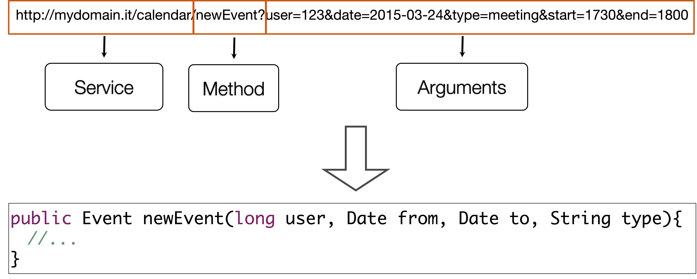

**Figure 4.14:** Level 1 URL Mapping to Resources.

When **modeling at Level 1 (Resources)**, the focus shifts from a single endpoint to **multiple, logically distinct resources**, each with its own **URI**. This approach improves resource identification and organization, but still falls short of full RESTful design because it often relies on a single HTTP method (typically `POST` or sometimes `GET`) for all operations.

**Core characteristics of Level 1 modeling:**

- **Individual Resource Addressing**:  
  - Each resource (such as a user, order, or device) is assigned a unique URI, making resources **globally addressable** and easier to manage.
- **Service Exposes Multiple Logical Resources**:  
  - The API provides separate endpoints for different entities (e.g., `/users`, `/orders`), enhancing clarity and modularity.
- **HTTP Used as a Tunnel**:  
  - Despite improved resource mapping, HTTP is still primarily used as a transport mechanism, not as an application protocol. The semantics of operations are embedded in the URI or payload, rather than leveraging HTTP methods.
- **Action Names and Parameters in URI**:  
  - Actions and parameters are encoded directly in the URI (e.g., `/users/create?name=John`), rather than in the request body or headers.
- **Triggering Actions via HTTP GET or POST**:  
  - Operations are performed by sending `GET` or `POST` requests to resource URIs. However, using `GET` to trigger side effects (such as creating or deleting resources) is **bad practice**—`GET` should be **idempotent** and safe, only used for retrieval.
- **Semantics Inserted in the URI**:  
  - The meaning of the operation is determined by the URI structure, not by the HTTP method, which can lead to confusion and misuse of HTTP conventions.
- **Still RPC-Oriented**:  
  - Although resources are better modeled, the interaction style remains **RPC-like**, with actions invoked via URIs rather than standard HTTP verbs.

> **Modeling takeaway:**  
> Level 1 improves resource mapping and global addressability, but true RESTful modeling requires using appropriate HTTP methods for each operation (e.g., `GET` for retrieval, `POST` for creation, `PUT` for updates, `DELETE` for removal). Avoid using `GET` for operations that cause side effects, as this breaks HTTP semantics and can lead to unpredictable behavior.

---

#### 4.4.2.1 Level 1: Example

This image illustrates a client making a request to a specific resource endpoint, for instance `/calendar/events`, using the HTTP GET method. The request includes query parameters such as `user=123` and `date=2015-03-24`, which allow the client to filter or locate specific event resources for a particular user and date. 

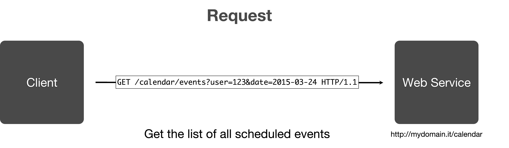

**Figure 4.15:** Level 1 Get Calendar Events Request. 

In this case, 

- The request **targets a resource** (events collection) and relies on the path and query string to identify what is needed.  
- Each type of **entity** (`events`) is **mapped to its own URI**, marking a step forward from Level 0's single endpoint.

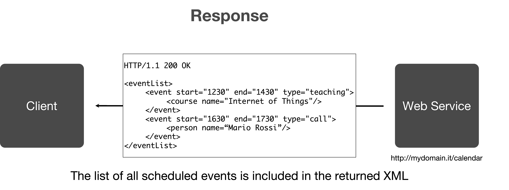

**Figure 4.16:** Level 1 Get Calendar Events Response.

This image shows the server's response to the above request: a standard HTTP/1.1 200 OK message containing an XML body. The returned XML `eventList` contains multiple `event` elements, each with structured details such as start/end times, type, and child elements (`course`, `person`).  

In this response:

- The response delivers a representation of the requested resource, formatted as a list of events.  
- Data is neatly scoped under well-defined XML elements (eventList, event), corresponding directly to the resource concept.

Now let's analyze the request and response associated to the creation of a new event instead of reading existing ones.

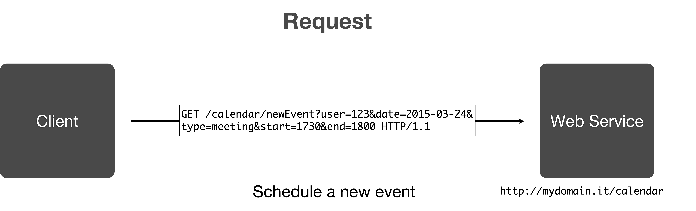

**Figure 4.17:** Level 1 Create Calendar Event Request.

Here, the client issues a GET request to `/calendar/newEvent`, using query parameters to define the specifics of the event to be scheduled (e.g., user, date, type, start/end times). All details required for the new event are put into the query string, making the URI expressive and resource-specific.  

In this scenario:

- The request creates or schedules a new event, with **all event details encoded in the request URI**.  
- Each event creation action is directed at a resource endpoint, using **URI parameters to specify new entity attributes**.


**Figure 4.18:** Level 1 Create Calendar Event Response.

This response is generated after the client schedules a new event. The server returns an HTTP/1.1 200 OK status and an XML representation of the newly scheduled event. The XML details the start and end times, along with the event type.  

For this last interaction:

- The server’s response is a direct representation of the resulting resource—the newly created event.  
- The returned XML object mirrors the resource identified by the initial request, reinforcing the resource-oriented model.

---

#### 4.4.2.2 Level 1 Characteristics & Limitations

At **Level 1 (Resources)**, RESTful modeling advances by introducing **multiple, individually addressable resources** through distinct **URIs**. This approach moves away from the single endpoint and opaque payloads of Level 0, enabling clearer organization and identification of entities within the system.

**Core Characteristics:**

- **Resource-Based Modeling**:  
  - Each entity (e.g., user, event, device) is mapped to a unique URI, making resources directly accessible and improving modularity.
- **Multiple Endpoints**:  
  - The API exposes separate endpoints for different resources, enhancing clarity and discoverability.
- **Single HTTP Method Usage**:  
  - Operations are typically performed using only one HTTP method (often `POST` or `GET`), regardless of the action (create, read, update, delete).
- **Action Semantics in URI or Payload**:  
  - The meaning of the operation is embedded in the URI structure or within the payload, rather than leveraging HTTP methods for intent.
- **Payload Format**:  
  - Requests and responses use **XML** or **JSON** to specify actions and resource data.

**Modeling Implications:**

- **Improved Resource Identification**:  
  - Clients can interact with specific resources, reducing ambiguity and improving maintainability.
- **Limited Use of HTTP Semantics**:  
  - The full power of HTTP methods (`GET`, `POST`, `PUT`, `DELETE`) is not utilized, which can lead to misuse of HTTP conventions (e.g., using `GET` for actions that cause side effects).
- **Transition Stage**:  
  - This level is common in services evolving toward RESTful design but not yet fully compliant with REST principles.

**Limitations:**

- **Incomplete RESTfulness**:  
  - Lack of proper HTTP method usage means the API does not fully benefit from REST’s scalability, safety, and clarity.
- **Potential for Confusion**:  
  - Encoding actions in URIs or payloads can make the API harder to understand and maintain.
- **Risk of Side Effects**:  
  - Using `GET` for operations that modify state violates HTTP standards and can cause unpredictable behavior.

> **Summary:**  
> Level 1 enhances resource modeling and endpoint clarity but falls short of true RESTful design due to limited use of HTTP methods and continued reliance on action semantics within URIs or payloads. Progressing to Level 2 by adopting proper HTTP verbs is essential for achieving full REST benefits.

---

### 4.4.3 Level 2: HTTP Methods

At **Level 2**, RESTful modeling advances by fully leveraging the semantics of **HTTP methods** to manipulate resources. This approach aligns with the **CRUD** (Create, Read, Update, Delete) operations and brings clarity, scalability, and loose coupling to API design. Core modeling characteristics of Level 2 are:

- **Resource Addressability**:  
  - Each resource is uniquely identified by a **URI**, making it directly accessible and manageable.
- **HTTP Method Semantics**:  
  - **HTTP verbs** are used to express the intended operation on a resource, adding clear semantics to interactions.
- **CRUD Mapping**:  
  - Each HTTP method maps to a specific CRUD operation:
    - **GET**:  
      - **Safe** (Indicates whether the HTTP method is "safe"—it does not modify resources on the server for example a GET only retrieves data) and **idempotent** (Indicates whether repeating the request yields the same outcome for example PUT and DELETE are idempotent while POST is not since it creates a new resource).
      - Used to **retrieve** a resource by its URI.
      - Does not modify the resource; repeated requests yield the same result.
    - **POST**:  
      - **Not safe** and **not idempotent**.
      - Used to **create** a new resource.
      - The server returns the URI of the newly created resource.
    - **PUT**:  
      - **Not safe** but **idempotent**.
      - Used to **update** an existing resource at the given URI.
      - Multiple identical requests produce the same result.
    - **DELETE**:  
      - **Not safe** but **idempotent**.
      - Used to **remove** the resource at the given URI.
      - Repeated requests have the same effect as a single request.
- **Safety and Idempotence**:
  - **Safe** methods (like GET) do **not cause side effects**—the resource remains unchanged.
  - **Idempotent** methods (like GET, PUT, DELETE) produce the same result whether called once or multiple times.

By adopting **Level 2**, APIs become more **predictable**, **maintainable**, and **aligned with web standards**. Clients interact with resources using standardized HTTP methods, reducing ambiguity and enabling independent evolution of client and server implementations. This level is a key milestone toward true RESTful design, supporting scalable and robust distributed systems.

**Summary Table of HTTP Methods and CRUD Operations**

The table explains the relationship between HTTP methods and their properties (safe, idempotent) as well as their typical mapping to CRUD operations in RESTful APIs[1].

| Method  | Safe | Idempotent | CRUD Operation |
|---------|------|------------|---------------|
| GET     | Yes  | Yes        | Read          |
| POST    | No   | No         | Create        |
| PUT     | No   | Yes        | Update        |
| DELETE  | No   | Yes        | Delete        |

Meaning of the columns:

- **Method**: The type of HTTP request.
- **Safe**: Indicates whether the HTTP method is "safe"—it does not modify resources on the server (e.g., GET only retrieves data).
- **Idempotent**: Indicates whether repeating the request yields the same outcome (PUT and DELETE are idempotent; POST is not).
- **CRUD Operation**: Refers to which CRUD (Create, Read, Update, Delete) operation the method usually implements.

Main points to note:

- **GET** is used for reading data, considered safe and idempotent.
- **POST** creates new resources, is not safe nor idempotent (multiple POSTs may result in multiple resources).
- **PUT** updates resources, not safe but idempotent (repeating PUT produces the same effect).
- **DELETE** removes resources, not safe but idempotent (repeating DELETE remains harmless after the first call)[1].

---

#### 4.4.3.1 Level 2: Response Codes

When **modeling RESTful APIs at Level 2**, it is essential to use **HTTP status codes** in alignment with the semantics of each HTTP method. 
This practice ensures that client-server interactions are **transparent**, **predictable**, and **standardized**, supporting robust and maintainable distributed systems.
The use of appropriate status codes **provides clear and immediate feedback to the client** about the outcome of each request, enabling clients to respond accordingly.

**Core Modeling Characteristics:**

- **Status Codes Convey Meaning**:  
  - Each status code has a specific, standardized meaning that communicates the outcome of a request.
  - Proper use of status codes enables clients to interpret responses and handle errors or success cases appropriately.

- **Method-Specific Status Codes**:  
  - Different HTTP methods are associated with particular sets of status codes, reflecting their intended operation and result.

- **Error Handling**:  
  - **4xx codes** indicate **client errors** (e.g., `405 Method Not Allowed`, `404 Not Found`), signaling that the client should not repeat the request without modification.
  - **5xx codes** indicate **server errors** (e.g., `500 Internal Server Error`), suggesting that the client might retry the request later.

**Typical Status Codes for RESTful Methods:**

- **GET**:  
  - Retrieves data from a resource.
  - Responds with `200 OK` upon success.

- **POST**:  
  - Creates a new resource.
  - Responds with `201 Created` to indicate successful creation.

- **PUT**:  
  - Updates an existing resource.
  - Responds with `200 OK` (resource replaced, representation returned) or `204 No Content` (successful update, no content returned).

- **DELETE**:  
  - Removes a resource.
  - Responds with `200 OK` (resource deleted), `202 Accepted` (deletion accepted, processing not complete), or `204 No Content` (resource deleted, no content returned).

**Summary Table: HTTP Methods and Status Codes**


| Method  | Typical Status Codes                          |
|---------|-----------------------------------------------|
| GET     | 200 OK                                        |
| POST    | 201 Created                                   |
| PUT     | 200 OK or 204 No Content                      |
| DELETE  | 200 OK, 202 Accepted, or 204 No Content       |


**Modeling Takeaway:**

- Using **standard HTTP status codes** in RESTful APIs provides clear feedback about the outcome of each request, enabling clients to respond appropriately and reducing ambiguity.
- This approach supports **loose coupling**, **interoperability**, and **scalability** in distributed systems.
- While the table lists the most common codes, many others (e.g., `400 Bad Request`, `401 Unauthorized`, `403 Forbidden`, `404 Not Found`) can be used to provide more specific feedback and improve error handling.

> See the next section for a more comprehensive overview of HTTP status codes and their modeling implications.

---

#### 4.4.3.2 Level 2: Do not reinvent the wheel (with Status Codes)

When **modeling RESTful APIs at Level 2**, it is crucial to **leverage standard HTTP status codes** rather than creating custom codes. 
This practice enhances interoperability, clarity, and maintainability of the API.

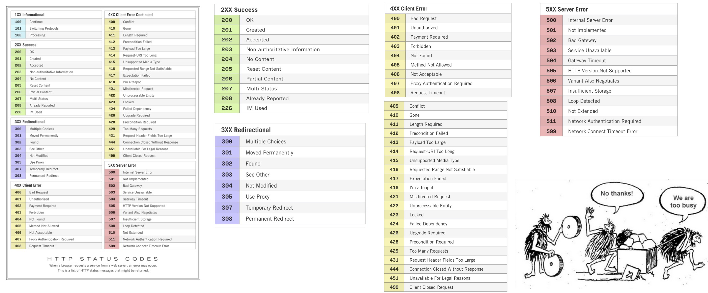

**Figure 4.19:** HTTP Status Codes Table [Link](https://www.steveschoger.com/status-code-poster/).

Some commonly used HTTP status codes in **RESTful APIs (Application Programming Interfaces)** include:

| Status Code | Usage Scenario                                                      |
|-------------|---------------------------------------------------------------------|
| 202 Accepted        | Request accepted for processing, but completion pending             |
| 204 No Content      | Success, no response body (usually DELETE, sometimes PUT)         |
| 301 Moved Permanently | Resource moved, update client bookmarks/links                    |
| 302 Found           | Temporary redirect, resource at different URI                      |
| 304 Not Modified    | Cached version is valid, no new data                               |
| 400 Bad Request     | Invalid/malformed input in request                                 |
| 401 Unauthorized    | Missing or invalid authentication                                  |
| 403 Forbidden       | Authenticated but not authorized                                   |
| 404 Not Found       | Resource does not exist                                            |
| 405 Method Not Allowed | Method not supported by endpoint                                 |
| 409 Conflict        | Resource state conflict (e.g., duplicate data)                     |
| 500 Internal Server Error | Server encountered an unexpected error                        |
| 503 Service Unavailable   | Server temporarily unable to handle requests                  |

**Modeling Implications:**

- **Standardization**: Using established HTTP status codes ensures that clients and developers can easily understand the API's behavior without needing to learn custom codes.
- **Interoperability**: Standard codes facilitate integration with various clients, libraries, and tools that expect conventional HTTP behavior.
- **Error Handling**: Clear and consistent status codes help clients implement robust error handling and recovery strategies.
- **Maintainability**: Avoiding custom codes reduces complexity and potential confusion, making the API easier to maintain and evolve.
- **Documentation**: Standard codes are well-documented and widely understood, simplifying API documentation and usage.
- **Avoiding Reinvention**: Creating custom status codes can lead to fragmentation and inconsistency, undermining the benefits of using HTTP as a protocol.
- **Best Practices**: Always refer to the official HTTP status code definitions and use them appropriately based on the context of the request and response.

---

#### 4.4.3.3 Level 2: HTTP Headers

When **modeling RESTful APIs at Level 2**, the use of **HTTP request headers** is a core aspect of designing robust, interoperable, and flexible systems. Headers provide a standardized way to convey **metadata**, control **behavior**, and enable **content negotiation** between clients and servers, all without altering the resource URI or payload structure.

**Key Modeling Characteristics of HTTP Headers:**

- **Metadata Transmission**:  
  - Headers deliver essential context about each request and response, such as **data format**, **encoding**, and **language preferences**.
- **Content Negotiation**:  
  - Clients and servers use headers like `Accept` and `Content-Type` to agree on the representation format (e.g., JSON, XML), supporting diverse client needs and extensibility.
- **Authentication & Security**:  
  - Headers such as `Authorization` and `Cookie` manage authentication, access control, and session state, ensuring secure interactions.
- **Performance & Caching**:  
  - Headers like `Cache-Control`, and `ETag` optimize caching strategies, reduce bandwidth usage, and improve response times.
- **Extensibility & Reliability**:  
  - Custom headers (e.g., `X-Request-ID`, `Retry-After`) enable advanced features, debugging, and cross-platform compatibility without breaking existing API contracts.
- **Separation of Concerns**:  
  - By keeping operational and contextual information in headers, the API maintains a clean separation between resource identification (URI), data (body), and control logic (headers).
  - Unlike the body—which contains the primary data—headers allow REST APIs to negotiate content types, manage authentication, support caching, enhance security, and enable extensibility without changing core API endpoints or payloads.

**Modeling Advice:**

- Use **standard headers** for common tasks (content negotiation, authentication, caching) to maximize interoperability.
- Employ **custom headers** judiciously for application-specific needs, ensuring they are well-documented and do not conflict with standard usage.
- Avoid encoding operational logic or sensitive information in the URI or body—leverage headers for these purposes to keep the API scalable and maintainable.

**Common Request Headers**

| Header            | Description                                         | Example                                      |
|-------------------|-----------------------------------------------------|----------------------------------------------|
| `Accept`          | Desired response content type                       | `Accept: application/json`                   |
| `Authorization`   | Credentials for API authentication                  | `Authorization: Bearer <token>`              |
| `Content-Type`    | Format of the data sent in the body                 | `Content-Type: application/json`             |
| `User-Agent`      | Identifies the client making the request            | `User-Agent: MyClient/1.0`                   |
| `Cookie`          | Session management                                  | `Cookie: sessionId=abc123`                   |

**Common Response Headers**

| Header                | Description                                   | Example                                     |
|-----------------------|-----------------------------------------------|---------------------------------------------|
| `Content-Type`        | Format of the response body                   | `Content-Type: application/json`            |
| `Content-Length`      | Length of the response body in bytes          | `Content-Length: 2048`                      |
| `ETag`                | Resource version identifier                   | `ETag: "v1.0.0"`                            |
| `Cache-Control`       | Caching policy                                | `Cache-Control: no-cache`                   |
| `Location`            | URI to a newly created or relocated resource  | `Location: /resource/12345`                 |
| `Set-Cookie`          | Sets a cookie in the client’s browser         | `Set-Cookie: sessionId=abc123; HttpOnly`    |


> **Summary:** Proper modeling and use of HTTP headers in RESTful APIs is essential for achieving **flexibility**, **security**, and **scalability**. Headers empower APIs to adapt to changing requirements and client capabilities, supporting robust distributed system design.

---

#### 4.4.3.4 Level 2: Interaction Flow - Create a New Resource

- **Interaction**: The REST client issues an HTTP `POST` to `/api/devices` with a payload containing the new device data.
- **Server Response**: The server returns status `201 Created` and includes a `Location` header pointing to the newly created device resource URI.
- **Purpose**: Adds a new resource to the server, following RESTful principles for resource creation.

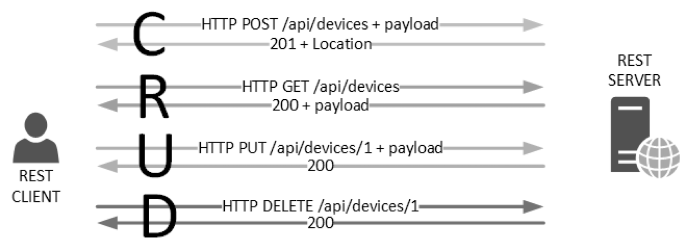

**Figure 4.20:** Example of HTTP POST Request to Create a New Resource.

---

#### 4.4.3.5 Level 2: Interaction Flow - Read a Resource

- **Interaction**: The REST client sends an HTTP `GET` to `/api/devices` (to list all devices) or to `/api/devices/1` (to retrieve a specific device).
- **Server Response**: The server returns status `200 OK` with a response payload containing the requested device information[2].
- **Purpose**: Retrieves the representation or list of resources, with no modification of server data.


**Figure 4.21:** Example of HTTP GET Request to Read a Resource.

---

#### 4.4.3.6 Level 2: Interaction Flow - Update a Resource

- **Interaction**: The REST client sends an HTTP `PUT` to `/api/devices/1` with a payload including the updated device information.
- **Server Response**: The server returns status `200 OK` indicating the resource was successfully updated[3].
- **Purpose**: Completely replaces the existing resource at the given URI with new data from the payload.


**Figure 4.22:** Example of HTTP PUT Request to Update a Resource.

---

#### 4.4.3.7 Level 2: Interaction Flow - Delete a Resource

- **Interaction**: The REST client issues an HTTP `DELETE` to `/api/devices/1` to remove a specific device resource.
- **Server Response**: The server returns status `200 OK`, confirming successful deletion of the resource[4].
- **Purpose**: Permanently removes the specified resource from the server, freeing up its URI.


**Figure 4.23:** Example of HTTP DELETE Request to Delete a Resource.

---

#### 4.4.3.8 Level 2: The Calendar Example Revisited

In this section, we revisit the calendar example, now modeled at **Level 2** of the REST maturity model. This level fully utilizes HTTP methods to perform CRUD operations on calendar resources, enhancing clarity, scalability, and adherence to RESTful principles.

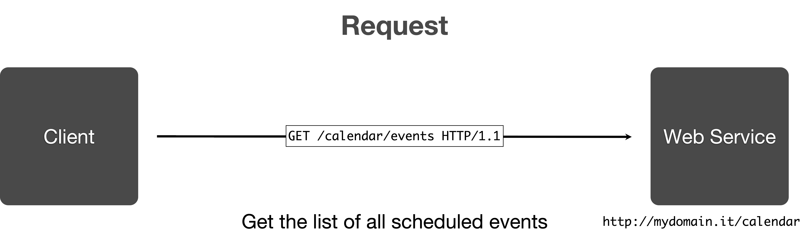

**Figure 4.25:** Calendar Example - HTTP GET Request to Retrieve Events.

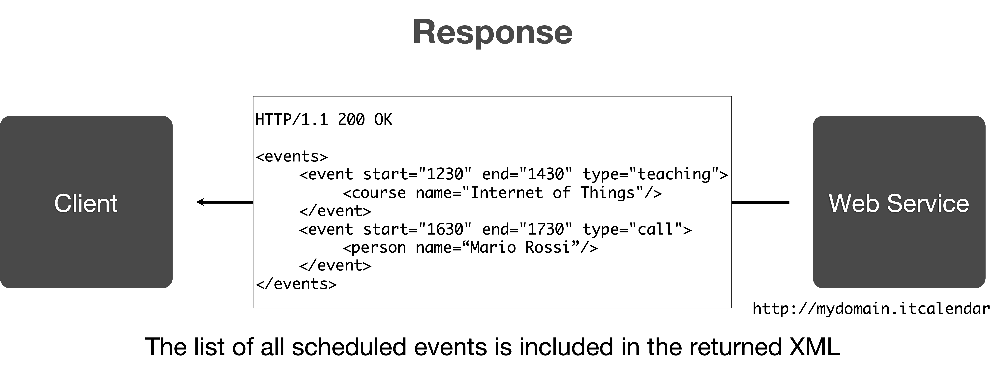

**Figure 4.26:** Calendar Example - HTTP GET Response to Retrieve Events.

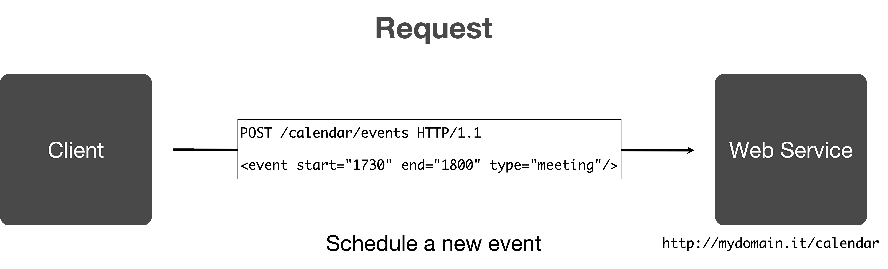

**Figure 4.27:** Calendar Example - HTTP POST Request to Create an Event.


**Figure 4.28:** Calendar Example - HTTP POST Response to Create an Event.

---

#### 4.4.3.9 Level 2: URI Templates & Conventions


When **modeling RESTful APIs**, the design of **URIs** is crucial for resource identification, discoverability, and maintainability. Two common approaches are **URI templates** and **flat URIs**, each with distinct modeling implications.

**URI Templates**

A **URI template** uses placeholders to represent variable parts of the resource path:

```
http://www.mydomain.it/publications/{pubId}
http://www.mydomain.it/course/{courseId}
```

**Modeling characteristics:**
- **Self-descriptive**: The URI structure clearly indicates the type of resource and its identifier.
- **Human-readable**: Easier for developers and users to understand and navigate.
- **Documentation-friendly**: Templates can be used in API docs for both human and machine consumption.
- **Potential risks**:
  - **Guessable states**: Clients may attempt to infer or manipulate URIs, which can lead to unintended access or tight coupling.
  - **Information leakage**: Avoid embedding sensitive or operational data in the URI.

**Modeling advice:**  

Use URI templates to make APIs intuitive and maintainable, but ensure that clients do not rely on guessing or manipulating URIs for application logic. Avoid using URIs to transfer operational information (e.g., actions or parameters), as this can degrade the API to Level 0 (RPC-style) rather than true resource-based modeling.

**Flat URIs**

A **flat URI** approach uses opaque identifiers without conveying resource type or hierarchy:

```
http://www.mydomain.it/182763182
http://www.mydomain.it/1083471237012
```

**Modeling characteristics:**
- **Opaque identifiers**: No information about the resource type or structure.
- **No discoverability**: Clients cannot infer relationships or resource types by inspecting the URI.
- **Reduced coupling**: Prevents clients from making assumptions about URI structure.

**Modeling advice:**  
Flat URIs are suitable for scenarios where resource types and relationships are managed through representations or metadata, not URI structure. This approach minimizes client assumptions but **can reduce human readability and documentation clarity**.

**Which Approach to Use?**

There is **no universal convention** for URI design in RESTful modeling. The choice depends on the application's requirements and the desired balance between **clarity**, **discoverability**, and **decoupling**.

**Best practices:**

- Use **URI templates** for clarity and documentation, as long as they do not create tight coupling or encourage clients to guess resource states.
- Ensure **URIs remain opaque** regarding operational details—use HTTP methods and headers for actions and parameters, not the URI path. (e.g., avoid `/createUser` or `/deleteUser` in favor of `POST /users` and `DELETE /users/{userId}`).
- Document URI conventions clearly to support both human and machine consumers.

> **Modeling takeaway:**  
> Well-designed URI templates enhance API usability and maintainability, but always prioritize loose coupling and avoid encoding operational logic in URIs. The goal is to model resources, not actions, through URI structure.

---

### 4.5 Level 3: Hypermedia as the Engine of Application State (HATEOAS)

At this highest level, the service incorporates **hypermedia controls** (links) within resource representations. **Clients can dynamically discover available actions** and **navigate** the application state through hyperlinks provided in responses. This level fully realizes RESTful principles and enables a more flexible and adaptable client-server interaction.

Some concepts to consider:

**What is Hypertext and Hypermedia in HTTP?**

**Hypertext** is structured text that uses logical links, called hyperlinks, which connect nodes of information (such as documents or other text units). It allows users to navigate non-linearly through related content by clicking or selecting these links. Hypertext forms the foundation of the World Wide Web, enabling interconnected documents and resources.
In the context of HTTP (Hypertext Transfer Protocol), hypertext refers to documents (often HTML pages) containing hyperlinks allowing users to jump from one resource to another seamlessly. This structure supports web browsing, dynamic navigation, and rich user experiences by linking multiple types of content across distributed servers.
In sum, hypertext is a powerful concept that organizes information through linked text nodes, enabling interactivity and flexible information access fundamental to the web and HTTP’s operation

An example of hypertext in HTTP is an HTML document containing hyperlinks:

```html
<!DOCTYPE html>
<html>
<head>
    <title>Hypertext Example</title>
</head>
<body>
    <h1>Welcome to My Website</h1>
    <p>This is an example of hypertext in HTTP.</p>
    <a href="http://www.example.com/about">About Us</a>
    <a href="http://www.example.com/contact">Contact</a>
</body>
</html>
```

**Hypermedia** in HTTP is a fundamental concept that extends hypertext by incorporating multimedia elements such as images, audio, and video alongside links that enable non-linear navigation between resources. In the context of RESTful APIs, **hypermedia controls are elements embedded within resource representations that provide dynamic instructions and navigational guidance** to clients. These controls, usually implemented as hyperlinks or forms, allow clients to discover available actions and navigate the API dynamically without prior knowledge of the service structure.

An example of hypermedia in HTTP is a JSON response containing links to related resources:

```json
{
    "userId": 123,
    "name": "John Doe",
    "links": {
        "self": "/users/123",
        "orders": "/users/123/orders",
        "profile": "/users/123/profile"
    }
}
```

The significance of hypermedia in REST is that it embodies the principle of **“Hypermedia as the Engine of Application State” (HATEOAS)**, where the server responses contain not only data but also actionable controls. This makes APIs more flexible, decoupled, and self-descriptive, enabling clients to interact with the server by following links and controls provided dynamically at runtime, rather than relying on fixed, out-of-band information.

> **Note:** In the scope of this course, we will not delve deeper into Level 3 and HATEOAS. However, it is important to be aware of its existence and significance in the REST architectural style and if you want you can find more information.

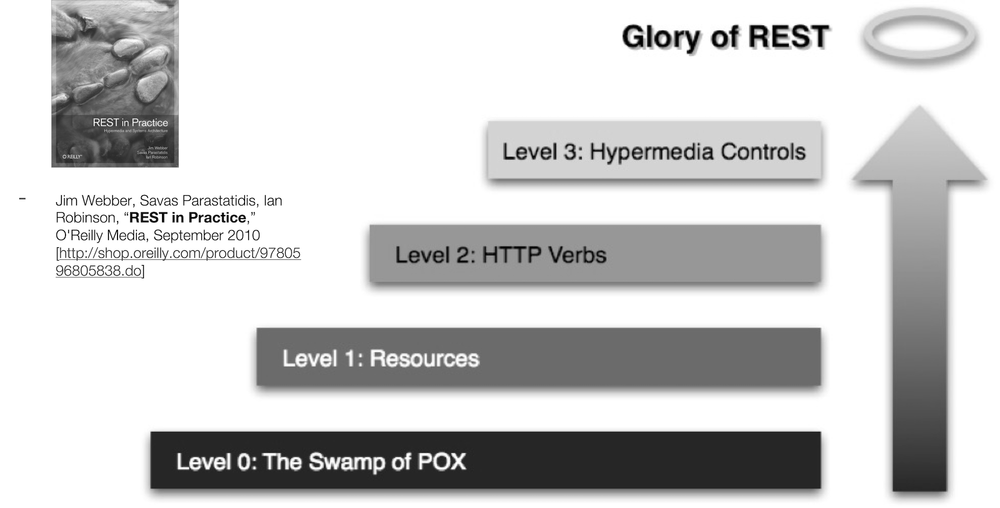

**Figure 4.29:** The maximum level of REST and a reference book for further reading.

---

# References

- Desai, Pratikkumar & Sheth, Amit & Anantharam, Pramod. (2014). Semantic Gateway as a Service Architecture for IoT Interoperability. 10.1109/MobServ.2015.51. [Link](https://doi.org/10.1109/MobServ.2015.51)
- REST Maturity Model - [Link](http://martinfowler.com/articles/richardsonMaturityModel.html)
- Jim Webber, Savas Parastatidis, Ian Robinson, “REST in Practice,” O'Reilly Media, September 2010 [Link](http://shop.oreilly.com/product/9780596805838.do)
- RFC5988 - [Link](https://tools.ietf.org/html/rfc5988)
- Web to Edge - [Link](https://www.w3.org/WoT/IG/wiki/images/d/de/WebToTheEdge-WoT.pdf)
- R. T. Fielding, “Architectural Styles and the Design of Network-based Software Architectures,” PhD thesis, University of California, 2000. Available: [Link](https://ics.uci.edu/~fielding/pubs/dissertation/top.htm)
- Roy T. Fielding and Richard N. Taylor. 2002. Principled design of the modern Web architecture. ACM Trans. Internet Technol. 2, 2 (May 2002), 115–150. https://doi.org/10.1145/514183.514185 [Link](https://dl.acm.org/doi/10.1145/514183.514185)
